# Scalable Agentic Orchestrator

<p align="center">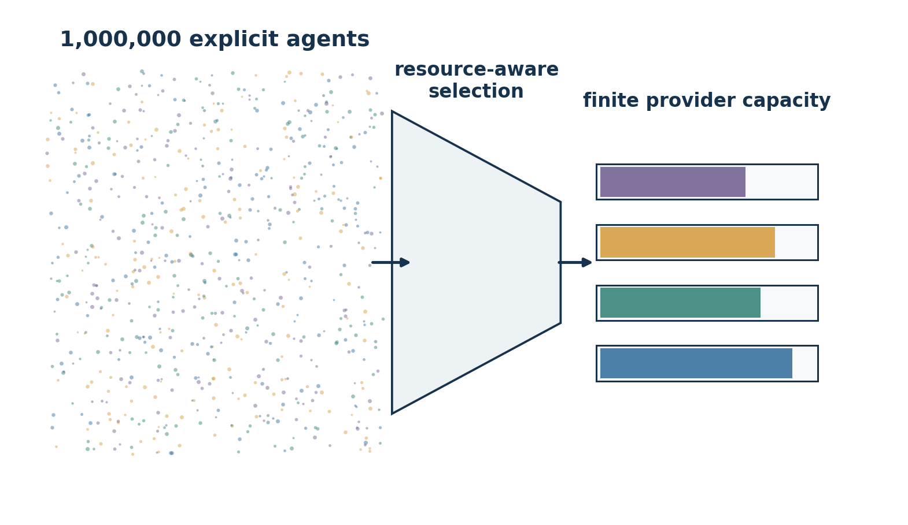</p>

**Resource-aware scheduling for one million explicit heterogeneous agents.**

**Author:** Angshul Majumdar · **Affiliation:** Indraprastha Institute of Information Technology Delhi · **License:** Apache-2.0

This repository is a complete implementation and a complete technical manual in one place. You do not need to open a separate PDF, follow a documentation link, or infer the design from source files. The architecture, mathematics, algorithms, command line, configuration, deployment procedure, experiments, controls, limitations, proofs, and operational runbook are all written below and illustrated inline.

The central engineering rule is uncompromising:

> **One million agents means one million demand vectors and one million scheduling identifiers.**

The implementation does not replace a million agents with a few hundred profile counts. It stores every agent explicitly in memory or as a NumPy memory map, scans the active population in deterministic shards, reduces each shard to a bounded candidate pool, applies an exact sparse solver to that pool, and then uses a separate feasibility packer to produce a capacity-safe launch batch.

The code implements:

| Family | Implemented policies |
|---|---|
| Greedy sparse pursuit | Matching Pursuit (MP), Orthogonal Matching Pursuit (OMP), Orthogonal Least Squares (OLS) |
| Continuous sparse optimization | Nonnegative FISTA, nonnegative IRLS with inexact conjugate-gradient inner solves |
| Operational baselines | Strict FIFO, windowed FIFO, Kahn-FIFO, LangChain-FCFS-policy, LangGraph-FCFS-policy |
| Execution semantics | Equal-duration wave simulation and heterogeneous-duration asynchronous event simulation |
| Scale mechanisms | Chunked explicit scans, memory maps, deterministic top-K MapReduce, process backend |
| Reproducibility | YAML/JSON configuration, held-out seeds, partial checkpoints, raw CSV, validation scripts, 40 tests |

## Read this first: what the repository does and does not claim

The useful regime is a large ready population whose adjacent queue entries have correlated resource demands. A strict or windowed arrival-order policy then suffers head-of-line blocking: the first part of the queue repeatedly asks for the same saturated resource while complementary agents deeper in the population remain unused. Sparse scheduling searches globally for compatible resource directions and mixes them into a better launch batch.

The repository also includes IID and deliberately complementary controls. In those regimes, FIFO may already be optimal or nearly optimal. The **Adaptive-SPARSE** policy measures order correlation and invokes the expensive sparse scheduler only when the queue exhibits the structure that makes reordering worthwhile.

The rows called `LangChain-FCFS-policy` and `LangGraph-FCFS-policy` are **policy-level emulations under the common simulator**. They are not measurements of installed LangChain or LangGraph framework overhead. The hard algorithmic comparison is against strict/windowed FIFO and Kahn-style ready-queue dispatch.

<p align="center">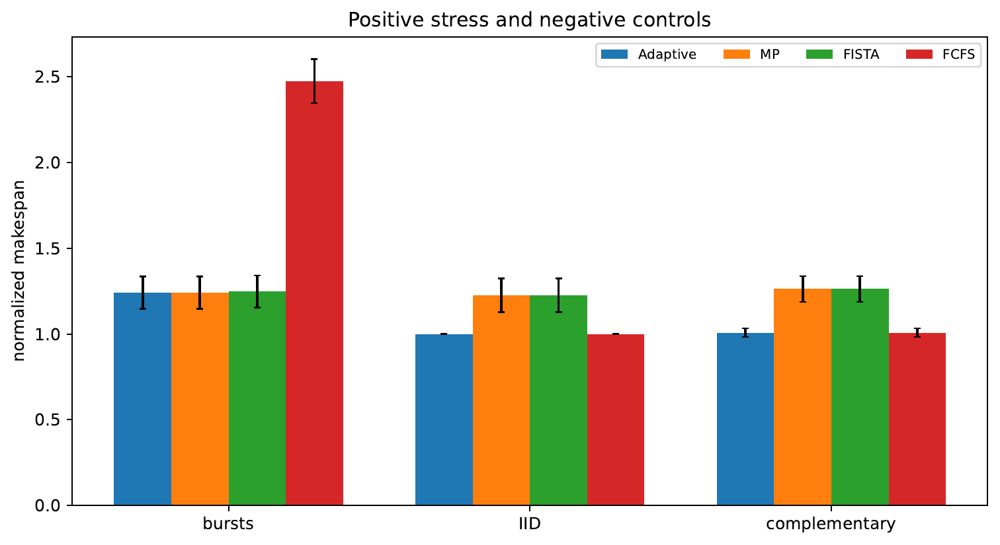</p>
<p align="center"><em>The method is intentionally conditional: sparse reordering helps correlated queues; the adaptive gate retains FCFS when reordering is unnecessary.</em></p>

## Five-minute start

### Install from the repository

```bash
python -m venv.venv
source.venv/bin/activate
python -m pip install --upgrade pip
python -m pip install -e '.[fast,test]'
pytest
```

On Windows PowerShell, activate with:

```powershell.venv\Scripts\Activate.ps1
```

### Run the smoke benchmark

```bash
sparse-orchestrator run configs/smoke.yaml
```

The run creates:

```text
results/smoke/
├── raw.csv
├── raw_partial.csv
├── summary.csv
├── metadata.json
└── REPORT.md
```

`raw_partial.csv` is rewritten after every completed method, so an interrupted run retains completed work.

### Generate one million explicit agents

```bash
sparse-orchestrator generate configs/million_agents.yaml data/million --overwrite
sparse-orchestrator inspect data/million --sample 100000
```

The inspect command reports the exact row count, shape, dtypes, generator metadata, demand statistics, duration mode, and sampled uniqueness.

### Run the full million-agent benchmark

```bash
sparse-orchestrator run configs/million_agents.yaml
```

The default configuration contains ten held-out seeds and all methods. It is intentionally expensive. For an initial full-scale integrity check, use one seed while keeping `n_agents: 1000000` unchanged.

### Run the process MapReduce backend

```bash
sparse-orchestrator run configs/million_agents_distributed.yaml --workers 8
```

The process backend requires memory-mapped arrays and refuses ordinary in-memory arrays rather than silently copying a million-row matrix into every process.

<p align="center">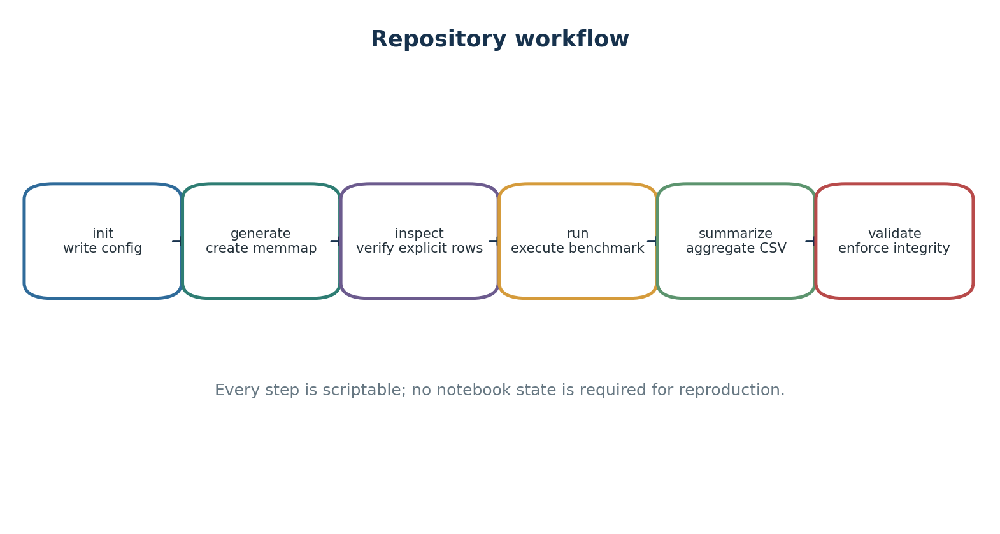</p>
<p align="center"><em>Generate, inspect, execute, summarize, and validate through one reproducible command-line path.</em></p>

## Repository layout

```text.
├── README.md                         complete manual and technical reference
├── LICENSE                           Apache License 2.0
├── pyproject.toml                    package metadata and dependencies
├── configs/                          smoke, million-agent, and distributed YAML
├── docs/assets/figures/              every figure embedded in this README
├── docs/assets/data/                 raw summaries used by the figures and tables
├── examples/                         custom-agent and reference-solver examples
├── scripts/                          reproduction, validation, and figure generation
├── src/sparse_orchestrator/
│   ├── benchmark/                    reproducible experiment runner
│   ├── distributed/                  local and process MapReduce backends
│   ├── schedulers/                   adaptive gate plus scalable scheduling policies
│   ├── solvers/                      mathematical MP/OMP/OLS/FISTA/IRLS solvers
│   ├── cli.py                        command-line interface
│   ├── config.py                     typed configuration and validation
│   ├── generator.py                  explicit workload generation
│   ├── metrics.py                    lower bounds and utilization
│   ├── model.py                      agents, providers, batches, traces
│   ├── packing.py                    exact componentwise feasibility packer
│   ├── reporting.py                  CSV/JSON/Markdown artifacts
│   ├── scoring.py                    deterministic candidate scoring and top-K
│   ├── simulator.py                  wave and asynchronous event execution
│   └── storage.py                    memory-mapped explicit datasets
└── tests/                             40 automated tests
```

<p align="center">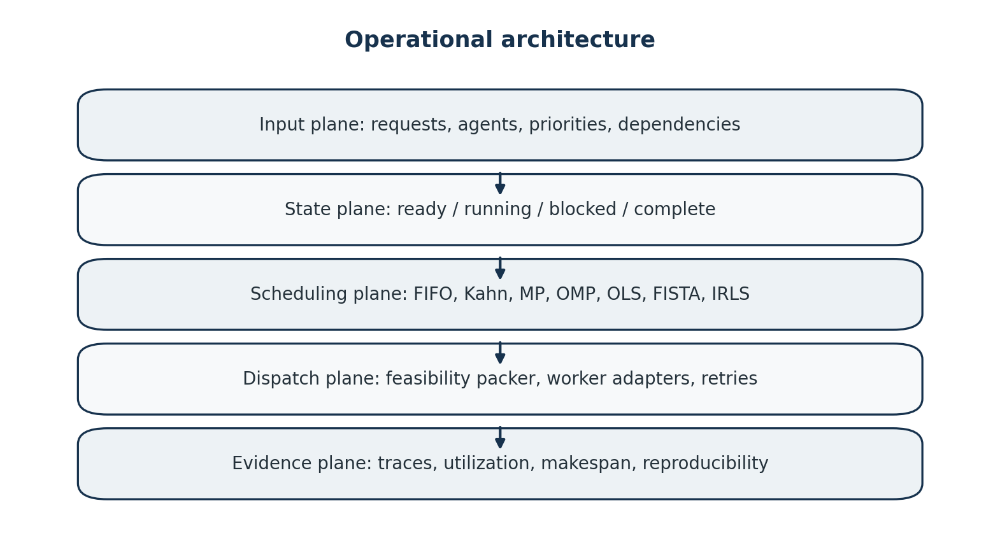</p>
<p align="center"><em>Readiness, admission, exact packing, execution, and evidence remain separate. The sparse optimizer is a replaceable control-plane component.</em></p>

## Current million-agent result

The frozen correlated-burst experiment contains one million explicit agents, four provider resources, ten held-out seeds, and equal-duration wave execution. Sparse policies may globally reorder the active population. FCFS policies preserve queue order. Completion quality is normalized by the resource-time lower bound; lower is better and `1.0` is the theoretical lower bound.

| Method | Completion quality | Execution waves | Scheduler time (s) |
| --- | ---: | ---: | ---: |
| Adaptive-SPARSE | 1.226 ± 0.079 | 18.0 ± 0.82 | 9.586 ± 1.613 |
| MP | 1.226 ± 0.079 | 18.0 ± 0.82 | 9.266 ± 1.534 |
| FISTA | 1.226 ± 0.078 | 18.0 ± 0.94 | 10.944 ± 0.904 |
| IRLS | 1.287 ± 0.101 | 18.9 ± 1.29 | 9.553 ± 0.883 |
| OMP | 1.355 ± 0.143 | 19.9 ± 2.08 | 9.571 ± 1.764 |
| OLS | 1.355 ± 0.143 | 19.9 ± 2.08 | 14.013 ± 2.533 |
| FIFO-Windowed | 2.451 ± 0.111 | 36.0 ± 1.33 | 0.041 ± 0.027 |
| Kahn-FIFO | 2.451 ± 0.111 | 36.0 ± 1.33 | 0.041 ± 0.027 |
| LangChain-FCFS-policy | 2.451 ± 0.111 | 36.0 ± 1.33 | 0.041 ± 0.027 |
| LangGraph-FCFS-policy | 2.451 ± 0.111 | 36.0 ± 1.33 | 0.041 ± 0.027 |

At this scale, MP and FISTA reduce mean completion time by roughly one half relative to windowed FCFS in the correlated-burst regime. That result is not universal: the controls later in this README show that unconditional sparse scheduling is worse than FCFS when the input order is already IID or complementary. The adaptive gate is therefore part of the production design, not an optional embellishment.

<p align="center">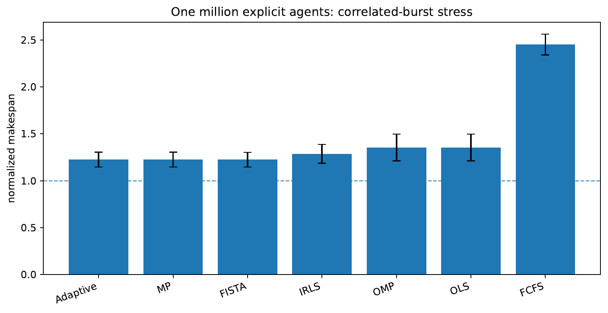</p>
<p align="center"><em>Completion quality for the one-million-explicit-agent correlated-burst stress test.</em></p>

<p align="center">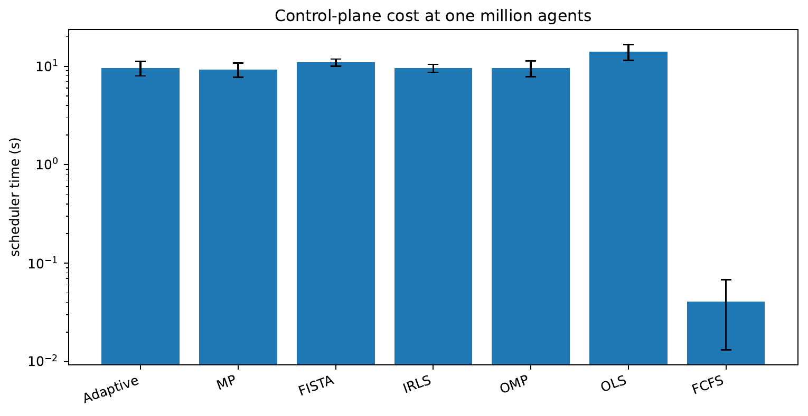</p>
<p align="center"><em>Control-plane cost is reported separately. Better schedules are not free.</em></p>

---
## The operational problem

### The question is not whether agents can run in parallel

Most orchestration stacks can launch work concurrently. The difficult question appears after the ready set becomes much larger than the provider can execute at once:

> *Which feasible subset should be launched now so that the complete population finishes as early as possible?*

Assume that $N$ agents are ready. Agent $i$ consumes a nonnegative resource vector $$d_i = (d_{i1},\ldots,d_{im})\in\mathbb{R}_+^m,$$ and the provider exposes finite capacity $$c=(c_1,\ldots,c_m)\in\mathbb{R}_+^m.$$ A launch set $S$ is feasible only when $$\sum_{i\in S} d_i \le c
  \qquad\text{componentwise.}
  $$

For a four-resource deployment, the coordinates may represent CPU, memory, network bandwidth, and accelerator occupancy. They may instead represent provider-specific limits such as concurrent model calls, token throughput, tool slots, and rate-limit buckets. The scheduler does not care what the dimensions are called. It requires only that demand and capacity use the same units.

<p align="center"></p>
<p align="center"><em>The operating regime: a very large explicit ready pool must be reduced to a capacity-feasible launch set. The orchestration problem is the selection step in the middle, not merely the ability to execute selected agents concurrently.</em></p>

### Why queue order matters

If all agents have nearly identical demands, arrival-order dispatch is usually sufficient. The scheduler takes the next feasible job and the provider remains well filled. The problem changes when demands are heterogeneous and correlated in arrival order. A long run of CPU-dominant agents can saturate CPU while leaving memory, network, and accelerator capacity unused. Complementary agents may exist deeper in the queue but cannot be reached by strict first-come-first-served dispatch.

<p align="center">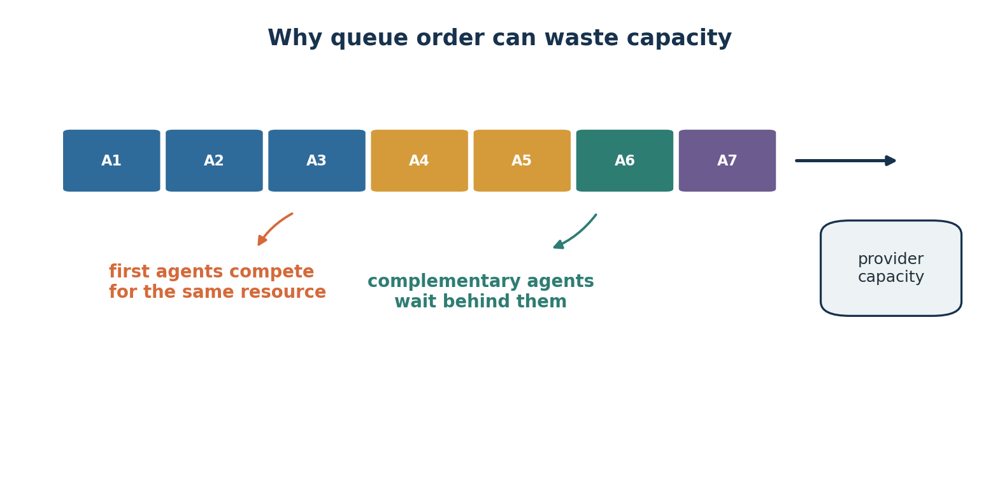</p>
<p align="center"><em>Head-of-line blocking. The front of the queue contains agents that compete for the same resource, while complementary agents remain inaccessible behind them.</em></p>

The practical loss is not abstract. It appears as:

- low minimum resource utilization even when the ready queue is large;

- more dispatch waves or completion events;

- longer total completion time;

- increased tail latency for requests whose agents sit behind an incompatible burst;

- avoidable provider cost when reserved capacity is paid for but not used.

### The narrow claim of this project

The project addresses one specific operating condition:

> A large explicit population of heterogeneous agents is ready, provider capacity is finite and multidimensional, and the dispatch order materially affects utilization.

It does not attempt to solve prompt quality, model selection, tool correctness, checkpoint storage, or network placement. It also does not claim that sparse optimization replaces graph runtimes. A graph runtime answers dependency and state questions. Sparse scheduling answers which ready agents should consume the next capacity slice.


**Practitioner rule.**


Use this system only after confirming that the ready set is large and that resource fragmentation, not dependency resolution, is the dominant bottleneck. For small or homogeneous workloads, the extra control-plane work is unnecessary.

### The million-agent integrity rule

The implementation adopts a strict definition:

> One million agents means one million demand rows and one million unique scheduling identifiers.

The benchmark generator is not allowed to replace the population with a small number of profile counts. Compression can be useful in a production system, but it must be stated explicitly. The repository’s validation path checks the declared population size, unique IDs, explicit-agent metadata, demand-row distinctness on a large sample, and schedule feasibility.

This rule matters because scheduling 256 profile counters is not evidence that the scheduler handles one million decision variables. The scalable implementation may reduce a million-row candidate scan to a bounded solver pool, but every row remains explicit and independently dispatchable.

### When the method is likely to help

The strongest operating signal is not agent count alone. The method is useful when the following conditions occur together:

1.  the ready pool is much larger than the provider’s concurrency capacity;

2.  agents differ materially across two or more resource dimensions;

3.  queue order contains bursts or locality that create head-of-line blocking;

4.  global reordering is operationally acceptable;

5.  execution lasts long enough for improved packing to repay scheduling overhead.

If any of these conditions is absent, start with FIFO, windowed FIFO, or Kahn-FIFO and measure before adding an optimizer.

## System architecture

### Five planes, one scheduling decision

The implementation separates the system into five planes. This separation is more important than the choice between MP and OLS because it prevents scheduling mathematics from leaking into execution correctness.

<p align="center"></p>
<p align="center"><em>Operational architecture. The scheduling plane proposes a launch order; the dispatch plane remains responsible for exact feasibility and execution.</em></p>

#### Input plane

The input plane receives explicit agent descriptions. At minimum, each agent has an ID, demand vector, duration, and arrival position. Optional fields include priority, dependency count, tenant, model family, tool class, deadline, and retry policy.

#### State plane

The state plane owns lifecycle truth. The optimizer does not directly mutate lifecycle state. It receives a ready-set view and returns candidate indices. This prevents a numerical solver from accidentally marking an agent running or releasing capacity twice.

#### Scheduling plane

The scheduling plane includes baselines and resource-aware methods under one interface. Every method sees the same ready agents and residual provider capacity. A method can return a ranking, a support, or dense coefficients. The downstream packer converts that output into a feasible dispatch batch.

#### Dispatch plane

The dispatch plane is authoritative for capacity. It checks componentwise for every accepted agent. It also performs provider adaptation, starts work, attaches execution IDs, and records the exact resources reserved.

#### Evidence plane

The evidence plane records raw per-run data, summary tables, partial checkpoints, configuration, versions, integrity metadata, and optional traces. It is deliberately separate from presentation code so the same raw result can generate CSV, JSON, Markdown, and README figures.

### Control plane and execution plane

The control plane decides. The execution plane acts. Combining them makes both testing and failure recovery harder.

<p align="center">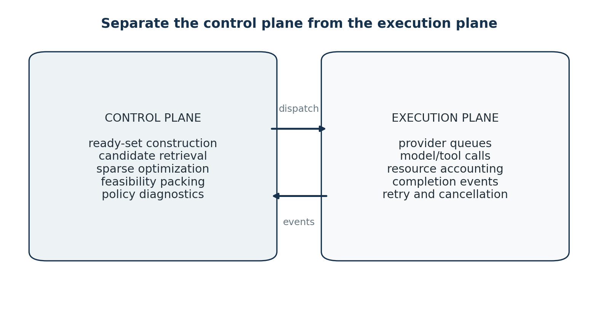</p>
<p align="center"><em>The control plane owns policy and selection. The execution plane owns provider calls, completion events, and resource release.</em></p>

The interface between the planes should contain only stable objects:

- dispatch batch ID;

- explicit agent IDs;

- reserved resource vectors;

- requested start time or immediate-start marker;

- policy diagnostics;

- idempotency token.

Completion events flow in the opposite direction and include success or failure, start and finish timestamps, released resources, retryability, and provider metadata.

### Lifecycle invariants

An agent moves through a small state machine. The implementation may add cancellation or suspension, but the core states should remain explicit.

<p align="center">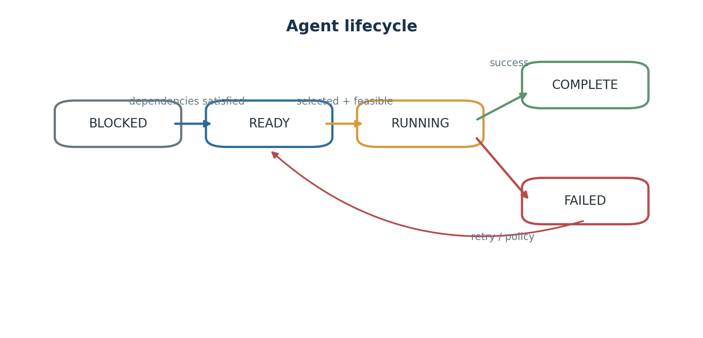</p>
<p align="center"><em>Agent lifecycle. A failed agent can re-enter the ready state only through an explicit retry policy.</em></p>

The following invariants are non-negotiable:

1.  an agent is present in exactly one lifecycle state;

2.  a running agent has exactly one active reservation;

3.  every reservation is released exactly once;

4.  a completed agent is never dispatched again;

5.  a retry receives a new attempt identity even when the logical agent ID is preserved;

6.  a blocked agent cannot enter a scheduler candidate pool.

**Operational warning.**

Do not let a solver operate directly on provider queues. The solver should return indices or scores. A separate transactional layer must perform state transition and resource reservation atomically.

### Reference deployment topology

The simplest production layout has one orchestrator service, a state store, a provider adapter, execution worker pools, and a metrics sink.

<p align="center">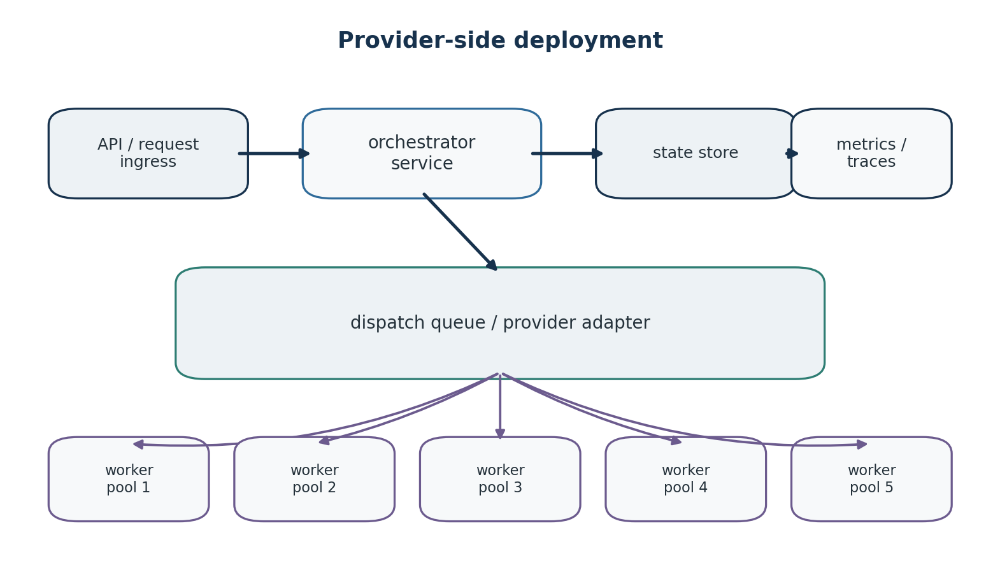</p>
<p align="center"><em>Reference provider-side deployment. Candidate retrieval may be parallelized inside the orchestrator service without changing the provider-facing dispatch contract.</em></p>

For high availability, run multiple orchestrator replicas but use a single logical ownership mechanism for each scheduling partition. Suitable patterns include lease-based partition ownership, a transactional ready queue, or an external leader per tenant. Active-active replicas without ownership fencing can dispatch the same agent twice.

### Recommended module boundaries

The repository mirrors the architecture:

**Implementation map.**

provider, agents, dispatch batches, traces, validation errors;

explicit workload generation and distinctness checks;

candidate scores and deterministic top-$k$ reduction;

reference MP, OMP, OLS, FISTA, and IRLS;

scalable policy implementations;

exact capacity-feasible batch construction;

wave and event execution semantics;

memory-mapped explicit datasets;

raw artifacts, summaries, and reports.

These boundaries are useful even if the implementation language changes.

## Data model and integrity

### Provider model

A provider is represented by positive capacity in $m$ dimensions: $$c\in\mathbb{R}_{++}^m.$$ Resource names are metadata, but the order is contractual. If the first coordinate means CPU in the provider object, the first coordinate of every demand row must mean CPU.

The provider constructor should reject:

- nonpositive capacity;

- nonfinite values;

- duplicate resource names;

- resource-name length different from the capacity dimension.

### Agent matrix

The core agent data is $$D=\begin{bmatrix}d_1^T\\ \vdots\\ d_N^T\end{bmatrix}
  \in\mathbb{R}_+^{N\times m}.$$ The implementation stores demands in row-major form because candidate retrieval scans agents. Float32 is usually adequate for resource demands and halves the demand-matrix footprint relative to Float64. Exact feasibility can still accumulate in Float64.

Associated arrays include:

- `durations`: one positive duration per agent;

- `ids`: unique 64-bit agent identifiers;

- `arrival_order`: a permutation of row indices;

- `priorities`: optional floating-point priorities;

- lifecycle masks or status codes;

- optional dependency metadata.

<p align="center">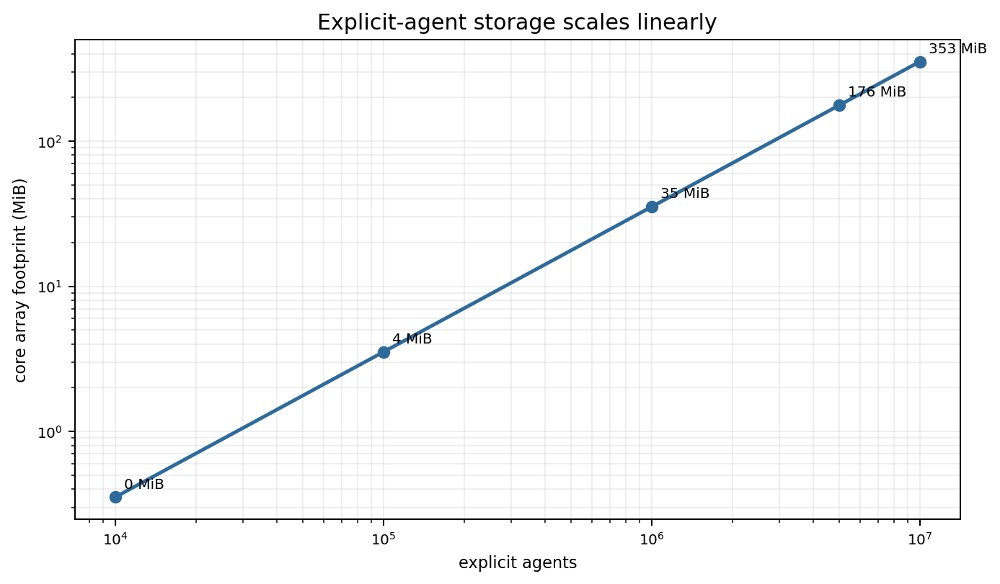</p>
<p align="center"><em>Approximate core-array footprint for four Float32 demand dimensions, Float32 duration, two Int64 index arrays, and one status byte. Python objects and traces are excluded.</em></p>

### Why array-oriented storage matters

One Python object per agent is easy to understand and expensive at one million rows. Object headers, references, dictionaries, and allocator fragmentation can exceed the numerical data by an order of magnitude. The core scheduling path should use contiguous arrays or columnar storage.

A practical split is:

- numerical scheduling fields in NumPy arrays or Arrow columns;

- bulky request payloads in an external store keyed by agent ID;

- provider handles in a runtime table created only after dispatch;

- optional traces allocated only when requested.

### Validation against provider capacity

Every agent must fit on an empty provider: $$d_i\le c\qquad\forall i.$$ An oversized agent otherwise remains ready forever and can make a simulation appear to hang. The generator and dataset loader should reject such rows before benchmarking.


**Procedure.**


For every loaded dataset:

1.  verify dimensions and finite values;

2.  verify nonnegative demands and positive durations;

3.  verify unique IDs and a valid arrival permutation;

4.  verify each row fits the provider;

5.  run an explicit-row distinctness sample;

6.  record the dtype and row count in metadata.

### Memory maps

A process backend should not pickle or copy a million-row demand matrix into every worker. The repository writes arrays as memory-mapped files and lets each worker open the demand matrix read-only. Workers receive only shard boundaries or explicit index arrays.

The storage contract should include:

- manifest version;

- shape and dtype of every array;

- resource names;

- generator and seed metadata;

- checksums for persistent datasets;

- endianness where cross-platform movement is expected.

### Optional dependency representation

The current million-agent stress benchmark uses independent agents. A production extension can add dependencies using compressed adjacency arrays:

- predecessor counts for readiness;

- compressed sparse row successors for release;

- a ready mask updated when the predecessor count reaches zero.

Kahn’s algorithm remains the right readiness primitive for DAGs. Sparse scheduling should run only after the ready set has been constructed. This preserves a clean distinction: $$\text{dependency correctness}\quad\longrightarrow\quad
  \text{resource-aware selection}.$$

## Workload construction

### Do not benchmark only one queue geometry

A scheduler can look excellent or irrelevant depending on arrival order. The repository therefore exposes three workload regimes. They reuse related agent families but arrange them differently.

<p align="center">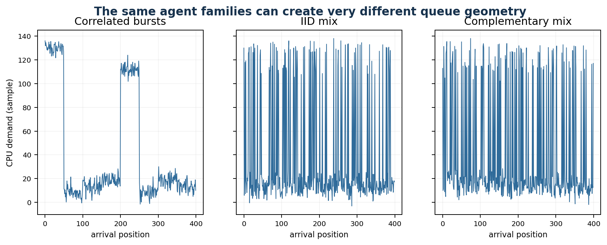</p>
<p align="center"><em>Three queue geometries. Correlated bursts are the favourable stress regime; IID and complementary mixes expose the boundary of the advantage.</em></p>

### Correlated bursts

The generator creates $K$ resource families. Each family has one dominant resource and one secondary resource. Agents receive independent lognormal multiplicative jitter and small additive perturbations, so every row remains distinct. Family counts are sampled, families are permuted, and each family occupies a contiguous queue segment.

A schematic centre construction is: $$\mu_{kr}=\begin{cases}
  U(d_{\min},d_{\max}), & r=r_k^{\text{dominant}},\\
  \gamma_k U(b_{\min},b_{\max}), & r=r_k^{\text{secondary}},\\
  U(b_{\min},b_{\max}), & \text{otherwise},
  \end{cases}$$ with $\gamma_k>1$. Each explicit agent is then $$d_i=\mu_{z_i}\odot\exp(\varepsilon_i)+\eta_i.$$

<p align="center">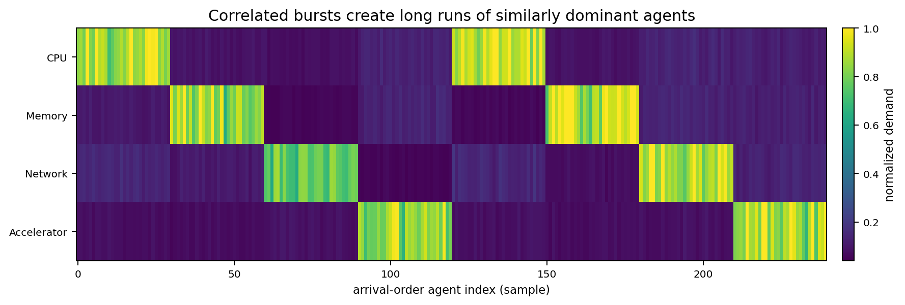</p>
<p align="center"><em>A sampled correlated-burst queue. Long contiguous runs have a common dominant resource, which creates head-of-line blocking for strict or narrow-window FIFO.</em></p>

This regime is favourable to a global resource-aware scheduler because it can interleave complementary families. It is also operationally plausible when requests are batched by tenant, model, region, retrieval source, tool type, or upstream producer.

### IID mix

IID generation draws the family label for every agent independently. Complementary jobs are already interspersed in queue order. A reasonable windowed FIFO can therefore recover much of the available packing quality without a global optimizer.

IID is the first control experiment to run after a favourable burst test. If the optimizer still reports a very large advantage, inspect the baseline implementation and the lower bound before trusting the result.

### Complementary mix

The complementary generator balances family labels and shuffles them. It checks whether the solver can exploit the available directions without relying on a pathological queue. This regime is also useful for regression tests: strong methods should approach the resource-time lower bound when complementary supply is abundant.

### Duration modes

The generator supports:

**Implementation map.**

All agents take the same time. Use the wave simulator and interpret makespan as execution waves.

Durations are heterogeneous and heavy-tailed. Use the event simulator. This is the more realistic setting for model and tool calls.

Durations vary within a bounded interval. This is useful for controlled sensitivity tests.

**Operational warning.**

Do not compare a resource-aware event scheduler against a baseline that is artificially forced to wait for a global barrier. All policies must receive the same completion events and release capacity asynchronously.

### Parameter separation

Workload parameters, solver parameters, and reported random seeds must be separated.

A defensible workflow is:

1.  select generator ranges from production observations or a documented stress objective;

2.  use pilot seeds to choose candidate-pool size and solver parameters;

3.  freeze the full YAML configuration;

4.  run disjoint held-out seeds;

5.  report all configured methods, including unfavourable results.

The README’s included stress result uses ten held-out seeds and one million explicit rows per seed. It is evidence that the implementation can expose the intended favourable regime, not evidence that the regime is universal.

## Execution semantics

### Wave simulation

Wave simulation is appropriate when all agents have the same duration. At every wave, the scheduler selects a feasible set, all selected agents start together, and all finish together. The provider capacity is fully restored before the next wave.

The lower bound is $$L_{\mathrm{wave}}=
  \left\lceil
  \max_{1\le r\le m}
  \frac{\sum_{i=1}^N d_{ir}}{c_r}
  \right\rceil.
  $$ It is a necessary resource-volume bound, not a guarantee that a discrete packing exists with exactly that many waves.

Wave mode is efficient for million-row experiments because it avoids a million-event priority queue. It is also easy to validate: every wave must satisfy the capacity inequality, and every agent must appear exactly once.

### Event simulation

Event simulation supports heterogeneous durations. A selected agent reserves resources at start and releases them at its own completion time. The next scheduling decision occurs when capacity is available and at least one agent is ready.

The resource-time lower bound is $$L_{\mathrm{event}}=
  \max\left\{
    \max_r\frac{\sum_i d_{ir}p_i}{c_r},
    \max_i p_i
  \right\},
  $$ where $p_i$ is the duration of agent $i$.

<p align="center">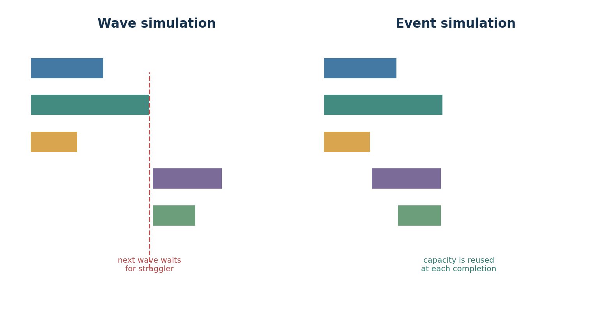</p>
<p align="center"><em>Wave and event semantics. In event mode, capacity released by a short agent can be reused immediately; no artificial global barrier is imposed.</em></p>

### Common event semantics for every policy

A benchmark must not let one method schedule continuously while forcing another to wait for a batch. The simulator, not the policy, determines when scheduling is allowed. All policies should receive the same:

- ready set;

- residual capacity;

- current time;

- completion events;

- duration data;

- failure and retry events.

The policy difference should be limited to the order or subset it proposes.

### Feasibility-only packing

The sparse solver operates on normalized candidate demands and may return coefficients that are not binary. The final packer traverses the derived ranking and accepts an agent only when it fits componentwise.


**Algorithm.**


$S\leftarrow\emptyset$

This separation is a safety property. An optimizer may be approximate, terminate early, or produce a dense relaxation. The packer still cannot oversubscribe capacity.

### Validation frequency

The reference configuration validates every dispatch. In a production deployment, full validation can be expensive. A staged policy is reasonable:

- always validate exact nonnegative residual capacity;

- always validate no repeated dispatch;

- sample expensive trace consistency checks;

- run full validation in canary and benchmark modes;

- fail closed if any capacity coordinate becomes negative beyond tolerance.


**Practitioner rule.**


Treat simulator semantics as part of the experiment specification. A change from wave to event mode, or from strict FIFO to windowed FIFO, is a new experiment, not a harmless implementation detail.

## Baseline policies

### Strict FIFO

Strict FIFO considers the ready queue in arrival order and stops when the first unfittable item prevents progress. This is useful as a stress baseline because it exposes head-of-line blocking clearly. It is rarely the strongest production baseline.

The policy is computationally cheap: $$T_{\mathrm{FIFO}}=O(q)$$ for the number $q$ of examined queue entries. Its weakness is that the search horizon may be one agent even when hundreds of thousands are ready.

### Windowed FIFO

Windowed FIFO scans a bounded prefix and accepts feasible agents while preserving approximate queue locality. The window size $w$ controls the trade-off:

- small $w$: cheap, fair to arrival order, weak packing;

- large $w$: stronger packing, more scan cost, greater reordering;

- $w=N$: global greedy scan rather than meaningful FIFO.

For many systems, windowed FIFO is the baseline that must be beaten. It is simple, transparent, and already removes the worst single-item blocking.

### Kahn-FIFO

For DAG workloads, Kahn’s algorithm maintains predecessor counts and releases nodes whose counts reach zero. The ready set can then be dispatched in FIFO order. For the independent-agent special case, every agent is ready at time zero, so Kahn-FIFO reduces to an ordinary ready queue.

Kahn solves a different problem from sparse scheduling: $$\underbrace{\text{Kahn}}_{\text{which agents are legal?}}
  \qquad\text{then}\qquad
  \underbrace{\text{sparse scheduler}}_{\text{which legal agents fit best now?}}$$ They should be composed rather than treated as mutually exclusive.

### Framework-policy labels

The repository includes LangChain-FCFS-policy and LangGraph-FCFS-policy labels only to represent simple framework-level dispatch policies. LangChain supports concurrent runnable composition, and LangGraph uses a Pregel-inspired runtime. The repository does not execute installed framework stacks, serialize state, checkpoint graphs, or measure framework runtime overhead.

**Operational warning.**

Never label a local FIFO emulation as a measured LangChain or LangGraph runtime result. A genuine framework benchmark requires pinned versions, actual worker adapters, serialization, checkpointing, network transport, and identical provider calls.

### A fair baseline ladder

Use at least the following ladder:

1.  strict FIFO for stress visibility;

2.  windowed FIFO as the practical simple baseline;

3.  Kahn-FIFO when dependencies exist;

4.  one resource-aware greedy baseline such as best-fit decreasing;

5.  the sparse methods under test.

A method that wins only against strict FIFO has identified a real weakness but has not yet justified production complexity. A method that also beats a tuned window and a simple best-fit policy is much more interesting.

### Baseline diagnostics

Every baseline should report:

- number of queue entries examined per dispatch;

- number skipped because of infeasibility;

- minimum resource utilization;

- mean ready-set age;

- maximum reordering distance, where applicable;

- scheduler CPU time separately from execution time.

These diagnostics explain why a method wins. Without them, a makespan difference is difficult to operationalize.

## Sparse scheduling methods

### Scheduling reduction

At a dispatch instant, let $r$ be residual provider capacity. Let the candidate matrix contain normalized demand columns $$A=\left[\frac{d_1}{c},\ldots,\frac{d_M}{c}\right],
  \qquad
  b=\frac{r}{c},$$ where division is componentwise. The numerical problem is to find a sparse nonnegative combination of demand directions that explains $b$ well. The result is converted to an explicit-agent ranking and passed to the feasibility-only packer.

<p align="center">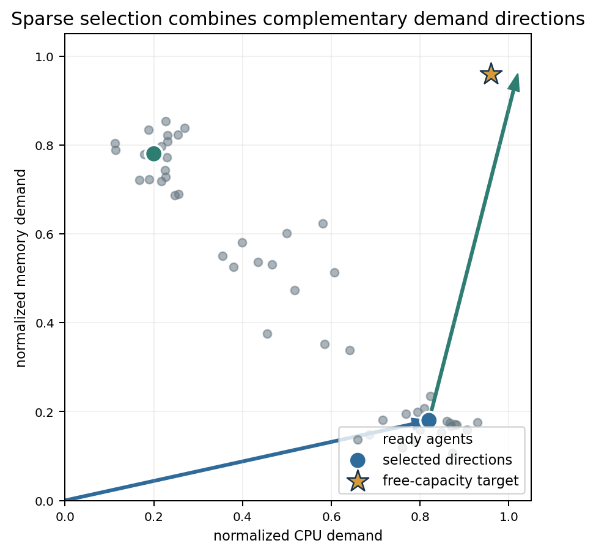</p>
<p align="center"><em>Sparse selection combines complementary demand directions to approach the free-capacity target. The two-dimensional picture is illustrative; the implementation supports arbitrary resource dimension.</em></p>

### Matching Pursuit

Classical Matching Pursuit selects the atom with maximum residual correlation: $$\begin{aligned}
  j_t &= \arg\max_j a_j^T r_t,\\
  \alpha_t &= \frac{a_{j_t}^Tr_t}{\|a_{j_t}\|_2^2},\\
  r_{t+1} &= r_t-\alpha_t a_{j_t}.
\end{aligned}$$ The scalable scheduler disables reselection because supports represent resource directions rather than a signal expansion with repeated atoms.

<p align="center">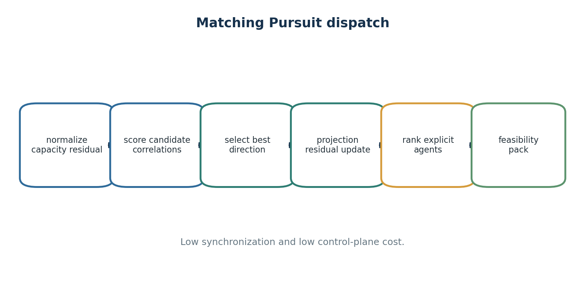</p>
<p align="center"><em>MP dispatch. Most work is correlation scoring and explicit-agent ranking; the solver state is small.</em></p>

MP is the recommended first optimizer because it has:

- simple diagnostics;

- bounded support size;

- low synchronization cost;

- strong compatibility with sharded candidate retrieval;

- predictable degradation when terminated early.

### Orthogonal Matching Pursuit

OMP selects by residual correlation but refits all active coefficients after every support update: $$\begin{aligned}
  S_t &= S_{t-1}\cup\{j_t\},\\
  x_{S_t} &= \arg\min_{x\ge0}\|b-A_{S_t}x\|_2^2,\\
  r_t &= b-A_{S_t}x_{S_t}.
\end{aligned}$$ The repository uses a projected active-set least-squares routine with a small ridge stabilizer for coherent candidate pools.

<p align="center">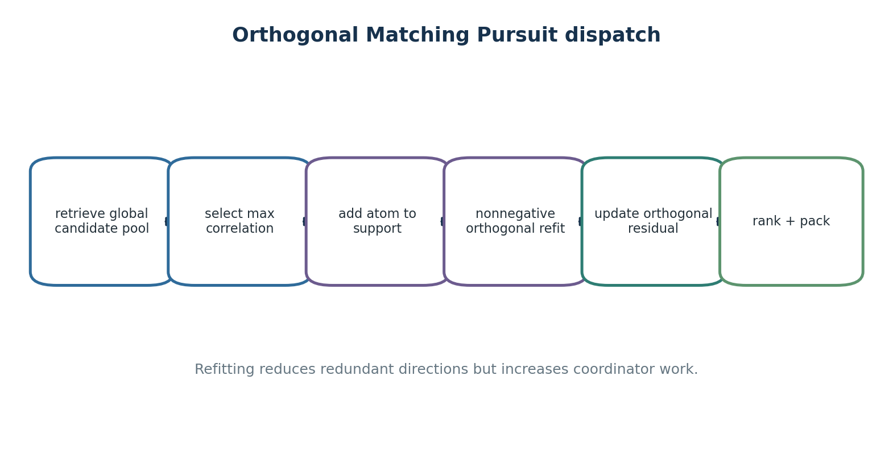</p>
<p align="center"><em>OMP dispatch. The complete support is refit after each selected direction.</em></p>

OMP is useful when MP repeatedly selects similar directions. It is not automatically superior for scheduling because the discrete packer, not coefficient recovery, determines the final batch.

### Orthogonal Least Squares

OLS evaluates each candidate by the residual obtained after adding it and refitting the complete support: $$j_t=\arg\min_{j\notin S_{t-1}}
  \min_{x\ge0}\left\|b-A_{S_{t-1}\cup\{j\}}x\right\|_2^2.$$ This look-ahead can choose a better next direction than correlation alone, but its candidate cost is much higher.

<p align="center">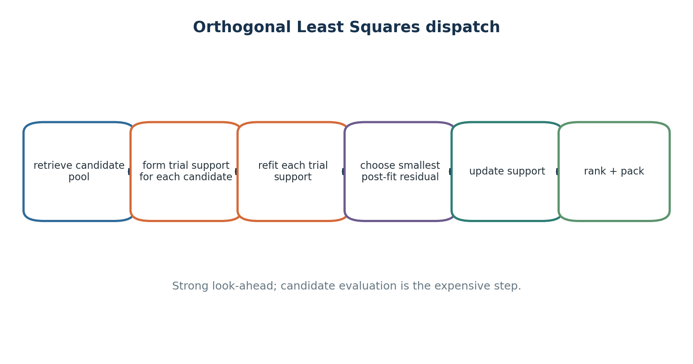</p>
<p align="center"><em>OLS dispatch. Every shortlisted candidate is tested after a complete support refit.</em></p>

The production scheduler therefore limits exact OLS evaluation to a small direction pool returned by the map stage.

### FISTA

FISTA solves the nonnegative $\ell_1$ relaxation: $$\min_{x\ge0}\frac12\|Ax-b\|_2^2+\lambda\|x\|_1.
  $$ With $L=\|A\|_2^2$, a proximal step is $$x^{k+1}=\max\left\{y^k-\frac1L A^T(Ay^k-b)-\frac{\lambda}{L},0\right\}.$$ The implementation includes monotone objective restart and adaptive gradient restart.

<p align="center">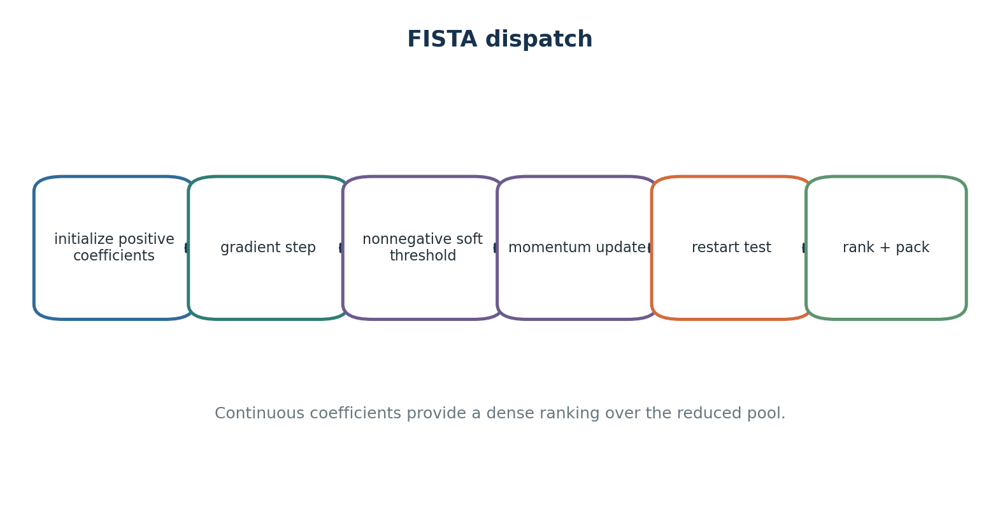</p>
<p align="center"><em>FISTA dispatch. Dense coefficients provide a ranking over the reduced candidate pool.</em></p>

FISTA is attractive when a dense ranking is useful and a few matrix-vector passes are acceptable. Its main operational controls are candidate-pool size, regularization, iteration budget, and restart behaviour.

### IRLS

IRLS uses a smoothed nonconvex sparsity penalty: $$\sum_j(x_j^2+\epsilon^2)^{p/2},\qquad 0<p\le1,$$ and solves weighted systems $$\left(A^TA+\lambda\frac p2 W_k\right)x_{k+1}=A^Tb,$$ where $$W_k=\operatorname{diag}\left[(x_{k,j}^2+\epsilon_k^2)^{p/2-1}\right].$$ The inner system is solved inexactly with conjugate gradients and increasing iteration caps.

<p align="center">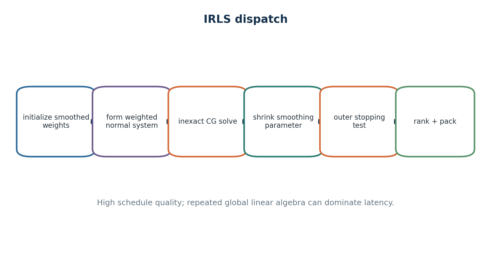</p>
<p align="center"><em>IRLS dispatch. Its quality can be strong, but repeated weighted linear solves increase control-plane cost and synchronization.</em></p>

### The solver does not own feasibility

All five methods are ranking engines in the scalable system. Their mathematical output is not trusted as a binary capacity allocation. The exact packer remains the final authority.


**Practitioner rule.**


Deploy MP first. Add OLS or FISTA only if production traces show that MP leaves substantial capacity fragmented. Reserve IRLS for cases where improved packing repays a larger and less predictable control-plane budget.

## Scaling to one million explicit agents

### Why the reference solver cannot see one million columns

A mathematically literal OMP or OLS implementation would score or refit against every active agent at every support step. That is unnecessary for a small resource dimension and operationally expensive. The scalable construction separates the million-row scan from the bounded sparse solve.

<p align="center">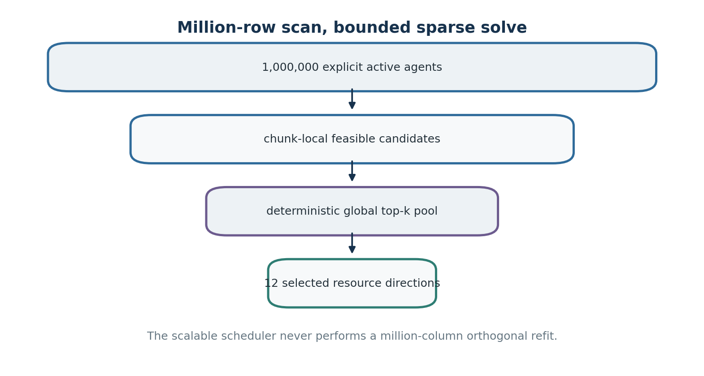</p>
<p align="center"><em>Scalable construction. Every active row is scanned, but only a bounded global candidate pool enters the exact sparse solver.</em></p>

### Stage 1: sharded candidate retrieval

The active ready set is split into deterministic chunks. Each chunk performs:

1.  active-row filtering;

2.  exact componentwise feasibility filtering;

3.  method-specific retrieval scoring;

4.  stable local top-$k$ selection.

A normalized affinity score can combine capacity correlation, cosine similarity, priority, and age. The exact formula is configurable, but deterministic tie-breaking must remain stable.

### Stage 2: deterministic reduction

The reducer merges local candidate IDs and scores, sorts by descending score and ascending global agent ID, and retains the bounded global pool. The ascending-ID tie break makes local and process backends reproducible.

If $P$ workers each return $k$ candidates, the coordinator receives $O(Pk)$ IDs and scores rather than $O(N)$ demand rows.

### Stage 3: exact solver on the reduced pool

MP, OMP, OLS, FISTA, or IRLS runs on the reduced matrix. The reference mathematical behaviour is preserved inside this pool. The solver returns sparse directions or dense coefficients.

### Stage 4: explicit-agent ranking

The selected directions are not assumed to be the complete dispatch batch. Every global-pool candidate receives a ranking score based on:

- map-stage retrieval score;

- coefficient magnitude, where available;

- weighted cosine affinity to selected directions;

- optional priority and age terms.

The packer consumes this ranking and may perform bounded refill rounds to use residual capacity.

### Candidate-pool controls

The important configuration fields are:

**Implementation map.**

number of candidates retained globally;

rows scanned per logical map task;

candidates returned by each chunk or worker;

support or direction limit for the sparse solver;

candidates subjected to expensive exact OLS evaluation;

bounded passes used to fill residual capacity.


**Procedure.**


Tune in this order:

1.  increase `local_top_k` until shard boundaries no longer change quality materially;

2.  increase `pool_size` until the solver’s result stabilizes;

3.  increase `direction_budget` only if selected directions remain redundant or residual capacity remains structured;

4.  increase refill rounds only after verifying that the initial ranking is strong;

5.  measure scheduler time after every change.

### Complexity model

Let $N$ be active agents, $m$ resources, $M$ global candidates, and $s$ selected directions. The dominant terms are approximately: $$\begin{aligned}
  T_{\mathrm{scan}} &= O(Nm),\\
  T_{\mathrm{MP}} &= O(Mms),\\
  T_{\mathrm{OMP}} &= O(Mms+s^3),\\
  T_{\mathrm{OLS}} &\approx O(Ms^3)\ \text{on the direction pool},\\
  T_{\mathrm{FISTA}} &= O(KMm),\\
  T_{\mathrm{IRLS}} &= O(K_{\mathrm{outer}}K_{\mathrm{CG}}Mm).
\end{aligned}$$

At million-row scale, the scan is the natural distributed target. The bounded refit usually remains a coordinator operation.

### Avoid hidden heuristic substitution

A common failure is to label a scheduler OMP while it performs only one residual subtraction and no orthogonal refit. The repository keeps reference solvers and scalable schedulers separate so the exact numerical method can be tested on small dictionaries.

Every scalable method should expose diagnostics such as support size, residual norm, objective, iteration count, and termination reason. These make it possible to verify that the intended solver actually ran.

## Distributed candidate retrieval

### MapReduce-style decomposition

The distributed design follows the MapReduce principle of local processing followed by bounded aggregation. The operation proportional to $N$ is candidate retrieval, so that is what the repository distributes.

<p align="center">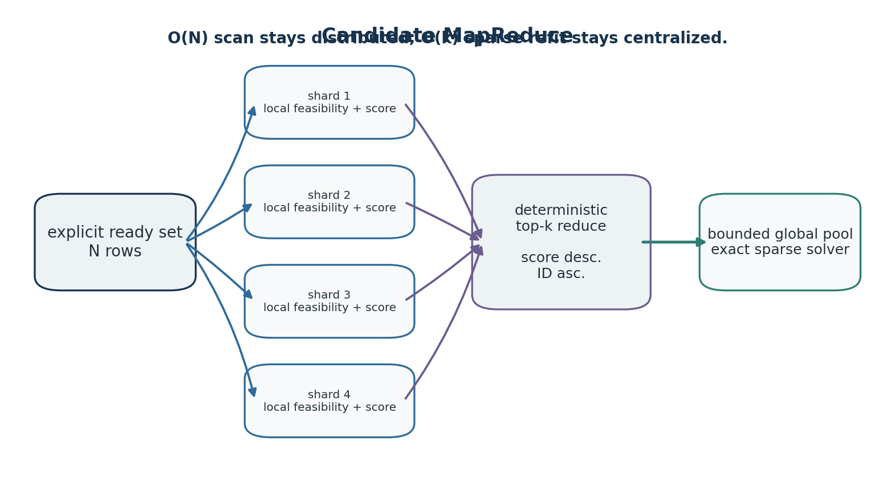</p>
<p align="center"><em>Candidate MapReduce. Workers return local top candidates rather than complete demand shards.</em></p>

For each dispatch:

1.  the coordinator determines active indices and residual capacity;

2.  active indices are partitioned into deterministic shards;

3.  each worker opens the demand memmap read-only;

4.  workers filter and score local rows;

5.  workers return local IDs, scores, and diagnostics;

6.  the coordinator performs stable global top-$k$ reduction;

7.  the bounded sparse solve and final packing run centrally.

### Local backend

The local backend scans chunks in one process. NumPy kernels release the GIL for expensive vectorized work, so this backend is often faster than process distribution on one machine. It also avoids startup, interprocess serialization, and duplicate page faults.

### Process backend

The process backend requires a memory-mapped demand matrix. It refuses ordinary arrays because passing them to spawned processes can silently replicate the full population.

<p align="center">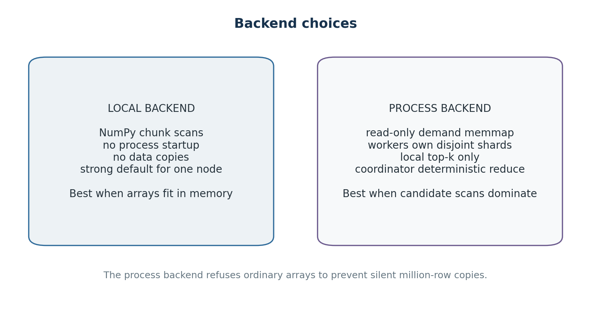</p>
<p align="center"><em>Local and process backends. The correct choice depends on whether candidate scans dominate process and storage overhead.</em></p>

### Determinism across workers

Floating-point top-$k$ operations can become nondeterministic if equal scores depend on worker completion order. The reducer must use a complete ordering: $$(-\text{score},\ \text{global agent ID}).$$ The test suite checks that local and two-process backends return identical IDs and scores for the same data.

### Communication volume

For $P$ workers and local top-$k$ size $k$, the reducer receives $Pk$ IDs and scores. The coordinator then reads the selected demand rows from shared storage. This is preferable to sending demand vectors in every worker response.

The process backend is still one-machine MapReduce-style execution, not a cluster transport. A cluster implementation can preserve the same narrow interface:

``` python
class CandidateBackend(Protocol):
    def retrieve(
        self,
        agents: AgentSet,
        active_indices: np.ndarray,
        residual_capacity: np.ndarray,
        request: CandidateRequest,
    ) -> CandidatePool:...
```

Ray, Spark, MPI, or a provider-native map service can implement this interface without changing the solver or simulator.

### When distribution helps

Distribution is justified when:

- the active scan dominates total scheduler time;

- the demand matrix already lives in shared or distributed storage;

- each worker processes enough rows to amortize startup;

- the candidate return size is much smaller than the shard;

- dispatch frequency is not so high that collective latency dominates.

It is not justified for tiny ready sets or very frequent sub-millisecond decisions.


**Practitioner rule.**


First optimize the local chunk scan. Add processes only after profiling shows that the scan, rather than solver refitting or packing, is the bottleneck.

## Repository workflow

### Install and verify

Create an isolated environment and run the test suite before any benchmark:

``` bash
python -m venv.venv
source.venv/bin/activate
python -m pip install --upgrade pip
python -m pip install -e '.[fast,test]'
pytest
```

The optional `fast` dependencies accelerate selected kernels. The required runtime dependencies are NumPy, pandas, and PyYAML.

### The command sequence

The CLI provides a complete scriptable path from configuration to validation.

<p align="center"></p>
<p align="center"><em>Repository workflow. Every stage is available from the command line and leaves inspectable artifacts.</em></p>

#### Create a configuration

``` bash
sparse-orchestrator init experiment.yaml --agents 1000000
```

#### Generate an explicit memory-mapped dataset

``` bash
sparse-orchestrator generate \
  configs/million_agents.yaml \
  data/million --overwrite
```

#### Inspect integrity

``` bash
sparse-orchestrator inspect data/million --sample 100000
```

The output reports row count, shape, dtypes, duration mode, generator metadata, demand statistics, and sampled demand-row uniqueness.

#### Run locally

``` bash
sparse-orchestrator run configs/million_agents.yaml
```

#### Run the process backend

``` bash
sparse-orchestrator run \
  configs/million_agents_distributed.yaml \
  --workers 8
```

#### Summarize and validate

``` bash
sparse-orchestrator summarize \
  results/million_agents/raw.csv \
  --output results/million_agents/summary.csv

python scripts/validate_results.py \
  results/million_agents/raw.csv \
  --agents 1000000
```

### Artifact layout

A benchmark run produces:

``` bash
results/million_agents/
|-- raw.csv
|-- raw_partial.csv
|-- summary.csv
|-- metadata.json
`-- REPORT.md
```

`raw_partial.csv` is rewritten after each completed method. An interrupted run therefore retains all completed work. The summary is derived from raw data rather than written independently.

### Configuration-driven execution

<p align="center">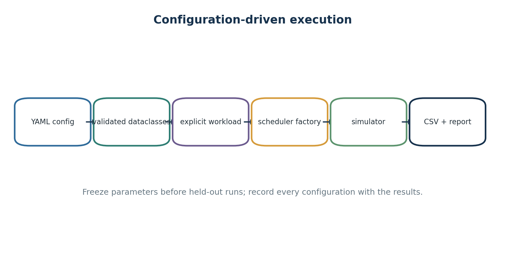</p>
<p align="center"><em>Configuration pipeline. Validated configuration objects control generation, scheduling, simulation, distribution, and reporting.</em></p>

A complete configuration contains generator, provider, scheduler, simulation, and distributed sections. Do not scatter benchmark parameters across scripts.

### Reference configuration

The one-million-agent stress configuration uses:

- $N=1{,}000{,}000$ explicit agents;

- four resources and eight correlated families;

- unit durations and wave simulation;

- provider capacity of three million units per resource;

- candidate pool size $65{,}536$;

- local top-$k$ size $16{,}384$;

- direction budget $12$;

- ten held-out seeds.

The complete YAML is included in the package and reproduced in.

### Using custom agents

A custom population can be created directly:

``` python
import numpy as np
from sparse_orchestrator.model import AgentSet, Provider

provider = Provider(
    capacity=np.array([4000, 8000, 2000, 1000]),
    resource_names=("cpu", "memory", "network", "accelerator"),
)

agents = AgentSet(
    demands=np.asarray(demand_rows, dtype=np.float32),
    durations=np.asarray(durations, dtype=np.float32),
    ids=np.asarray(agent_ids, dtype=np.int64),
)
agents.validate_against(provider)
```

The population can then be passed to a scheduler and either simulator. Keep request payloads outside the numerical matrix and retrieve them only for selected IDs.

## Deployment and operations

### Start with a shadow scheduler

Do not replace the production dispatcher first. Run the sparse policy in shadow mode:

1.  capture the exact ready set and residual capacity seen by production;

2.  ask the shadow scheduler for a batch;

3.  do not dispatch it;

4.  compare predicted utilization and completion against the actual batch;

5.  measure selector time and memory;

6.  retain enough traces to explain disagreements.

Shadow mode reveals whether the numerical model matches provider reality. Common mismatches include hidden rate limits, unmodelled tool slots, per-tenant quotas, and duration correlations.

### Canary rollout

After shadow validation, route a small scheduling partition to the new policy. A partition may be a tenant, workload class, provider region, or request hash range. Do not mix policies inside one capacity pool unless reservations remain globally consistent.

Canary gates should include:

- zero capacity violations;

- zero duplicate dispatches;

- bounded scheduler latency;

- no starvation beyond a configured age limit;

- improved or neutral completion time;

- rollback without losing ready-state ownership.

### Fairness and starvation

Pure packing can postpone awkward agents. Add an age or deadline term to the ranking, or reserve a fraction of each dispatch for oldest-ready agents. A practical score is $$s_i = s_i^{\mathrm{resource}} + \alpha\,s_i^{\mathrm{priority}} + \beta\,s_i^{\mathrm{age}}.$$ The coefficients should be visible in configuration and traces.

A stronger control is a hard maximum waiting time. Once an agent crosses the threshold, it enters a protected queue or receives dominant priority. This turns starvation prevention into an explicit service-level rule rather than an emergent property.

### Retries and failures

Provider calls fail. Resource accounting must remain correct across timeout, cancellation, partial start, and retry.

<p align="center">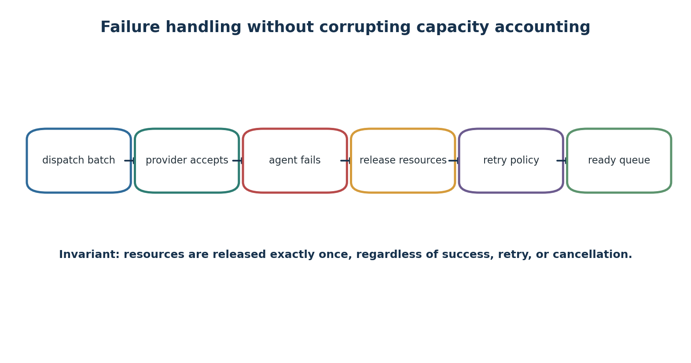</p>
<p align="center"><em>Failure recovery. Capacity release is transactional and occurs exactly once before a retry re-enters the ready queue.</em></p>

A retry policy should define:

- retryable error classes;

- maximum attempts;

- backoff and jitter;

- whether demand or duration estimates change after failure;

- whether the logical deadline is preserved;

- whether the retry can move to another provider.

### Backpressure

A scheduler cannot compensate indefinitely for arrival rate above service capacity. Monitor the ready-set growth rate: $$\Delta Q / \Delta t = \lambda_{\mathrm{arrival}}-\lambda_{\mathrm{service}}.$$ If it remains positive, apply admission control, queue quotas, load shedding, or provider scaling. Better packing increases service rate but does not remove the stability condition.

### Provider model drift

Demand estimates can drift when model versions, prompt lengths, tools, or hardware change. Compare estimated and observed resource use by workload class. Update the demand estimator before retuning the optimizer.

Useful drift indicators include:

- residual capacity predicted positive but provider rejects the batch;

- persistent underutilization after supposedly full packs;

- solver directions concentrated in obsolete workload classes;

- duration prediction errors correlated with demand families.

### Rollback design

The fallback dispatcher should always remain available. Rollback should switch policy selection without changing lifecycle or provider-adapter code. This is another reason to isolate the scheduling plane.


**Practitioner rule.**


The safest production architecture treats MP, OLS, FISTA, and IRLS as replaceable policy plugins. State transition, reservation, provider execution, and recovery remain identical across policies.

## Observability and diagnosis

### A scheduler must explain itself

A resource-aware scheduler can improve aggregate completion while making individual decisions less obvious than FIFO. Operational acceptance depends on traceability.

<p align="center">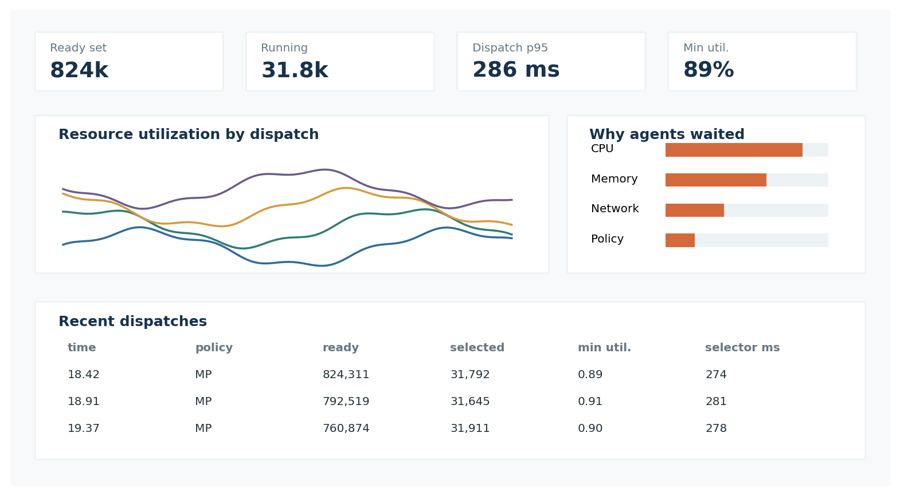</p>
<p align="center"><em>Illustrative scheduler dashboard. The minimum useful view combines queue state, resource utilization, waiting reasons, and dispatch latency.</em></p>

### Per-dispatch record

Record at least:

- scheduling timestamp and policy version;

- ready-set size and active candidate count;

- residual capacity before dispatch;

- selected agent IDs and aggregate demand;

- minimum, mean, and per-resource utilization;

- selector time, packer time, and total control-plane time;

- candidate-pool size and support size;

- solver iterations, residual, and termination reason;

- number of infeasible and rejected candidates;

- fairness overrides and protected agents.

### Per-agent explanation

For an agent that waited, the trace should answer one of four questions:

1.  Was the agent blocked by dependencies?

2.  Was its demand infeasible under residual capacity?

3.  Was it feasible but ranked below selected agents?

4.  Was it delayed by a fairness, quota, or provider rule?

For a selected agent, record its map score, coefficient or directional affinity, final rank, and the residual capacity before acceptance.

### Utilization diagnostics

Mean utilization can hide a single saturated resource. Report: $$u_r = \frac{\text{used}_r}{c_r},
  \qquad
  u_{\min}=\min_r u_r,
  \qquad
  u_{\mathrm{mean}}=\frac1m\sum_r u_r.$$ A pack with CPU at 100% and every other resource at 30% has high maximum utilization and poor multidimensional utilization. The minimum coordinate is often the clearest fragmentation indicator.

### Latency decomposition

Separate: $$\begin{aligned}
  T_{\mathrm{control}} &= T_{\mathrm{ready}} + T_{\mathrm{scan}} + T_{\mathrm{solve}} + T_{\mathrm{pack}} + T_{\mathrm{commit}},\\
  T_{\mathrm{execution}} &= T_{\mathrm{provider}} + T_{\mathrm{tools}} + T_{\mathrm{network}},\\
  T_{\mathrm{total}} &= T_{\mathrm{control}} + T_{\mathrm{queue}} + T_{\mathrm{execution}}.
\end{aligned}$$ If the solver is blamed for latency, verify which component actually grew.

### Alerting

Useful alerts include:

- negative residual capacity or provider batch rejection;

- scheduler p99 above a configured fraction of median agent duration;

- ready queue growing for multiple service intervals;

- minimum utilization below threshold while ready set is large;

- maximum agent age above SLA;

- local and distributed candidate reductions disagreeing in replay;

- nonfinite solver objective or repeated early termination.

### Replay

Persist enough information to replay a dispatch decision offline:

- configuration hash;

- policy code version;

- ready agent IDs and demand rows or dataset reference;

- residual capacity;

- deterministic seed;

- provider and fairness metadata.

Replay is invaluable when a policy appears to starve a class or when a provider rejects a supposedly feasible batch.

## Tuning and method selection

### Use the simplest policy that clears the bottleneck

The correct deployment is usually an escalation, not an immediate jump to IRLS.

<p align="center">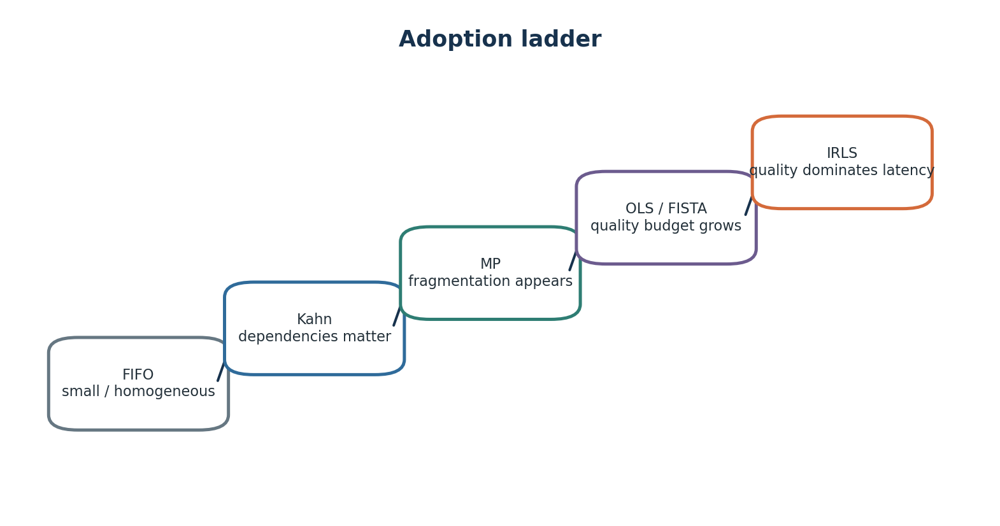</p>
<p align="center"><em>Adoption ladder. Increase solver sophistication only when the simpler level leaves measurable fragmentation.</em></p>

### Decision guide

<p align="center">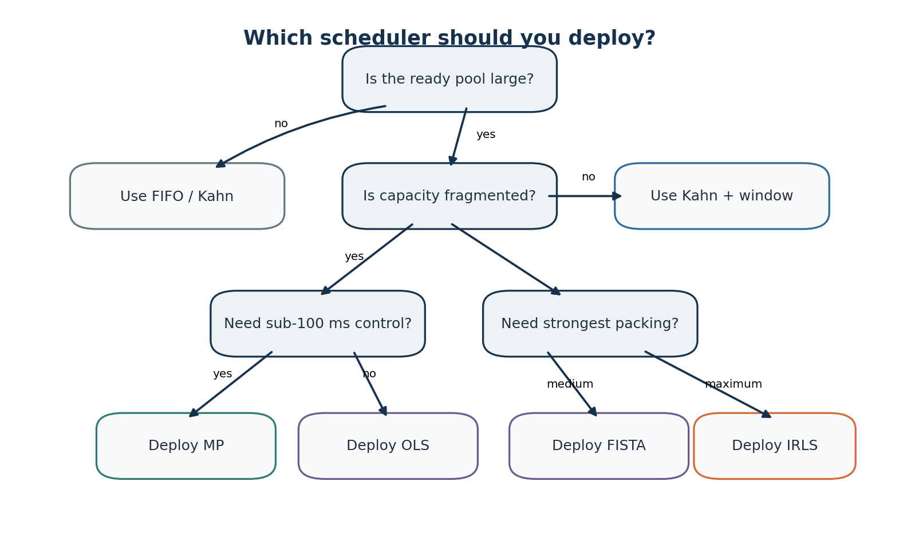</p>
<p align="center"><em>Practical scheduler-selection tree. The latency thresholds must be calibrated to the provider workload.</em></p>

### MP tuning

Important controls:

- direction budget;

- candidate-pool size;

- column normalization;

- retrieval score;

- residual stopping tolerance.

Increase direction budget only while new directions reduce residual structure. Excess directions can overfit the reduced pool without improving the discrete pack.

### OMP and OLS tuning

OMP adds support refitting. OLS adds candidate look-ahead. Their primary cost control is the direction pool. Do not evaluate OLS over the entire global candidate pool unless the pool is already small.

Use a ridge term when the support is coherent. Log condition estimates and active-set failures. If orthogonal refitting produces unstable coefficients, the ranking should fall back to retrieval scores rather than propagating nonfinite values.

### FISTA tuning

FISTA’s main parameters are $\lambda$, iteration budget, and restart policy. A large $\lambda$ produces a sparse but possibly underfilled ranking. A small $\lambda$ produces dense coefficients that can be difficult to distinguish.

Recommended procedure:

1.  normalize columns and target;

2.  estimate $L=\|A\|_2^2$ conservatively;

3.  choose $\lambda$ on pilot workloads;

4.  use monotone restart;

5.  terminate on relative objective change or fixed operational budget;

6.  evaluate final discrete pack, not only the relaxation objective.

### IRLS tuning

IRLS is sensitive to $p$, smoothing $\epsilon$, outer iterations, and inner CG accuracy. Start with a modest outer count and an increasing inner cap. Solving early weighted systems too accurately wastes work because weights will change.

Track:

- weighted objective;

- CG residual;

- fraction of coefficients near zero;

- condition estimates;

- total matrix-vector products.

### Candidate-pool tuning

Candidate retrieval can dominate quality. A perfect solver cannot recover an agent that never enters the pool. Tune retrieval separately from solver iteration count.

Use shard-invariance tests: change chunk boundaries while holding the explicit population fixed. If quality changes materially, local top-$k$ is too small or scoring is unstable.

### Decision frequency

Re-optimizing after every completion can be wasteful. Options include:

- schedule only when free capacity exceeds a threshold;

- coalesce completion events for a few milliseconds;

- reuse a ranking while the ready set changes slowly;

- use MP frequently and a heavier policy periodically;

- maintain separate fast and deep scheduling paths.

### A practical hybrid

A strong production pattern is:

1.  Kahn constructs the ready set;

2.  MP runs for normal dispatches;

3.  an age override protects old agents;

4.  FISTA or OLS runs when minimum utilization remains below threshold for several dispatches;

5.  IRLS is reserved for batch windows where control-plane latency is unimportant.

This obtains most of the benefit without paying maximum solver cost continuously.

## Limits, boundaries, and roadmap

### Where the approach does not help

Sparse scheduling is unlikely to matter when:

- the ready set is smaller than available concurrency;

- all demands are nearly proportional;

- one resource is always the only binding constraint;

- queue order is already well mixed;

- global reordering violates fairness or business rules;

- average agent duration is shorter than scheduler latency;

- provider limits are unknown or highly volatile.

In these cases, FIFO, windowed FIFO, or Kahn-FIFO is preferable.

### What the current repository does not claim

The repository does not claim:

- measured installed LangChain or LangGraph framework performance;

- universal 62% improvement;

- cluster-wide distributed sparse refitting;

- dependency-aware million-node DAG benchmarks in the default configuration;

- online learning of resource demand;

- optimal discrete multidimensional packing;

- provider inference acceleration.

The stress result demonstrates that the implementation can schedule one million explicit agents and exploit a queue geometry designed around multidimensional fragmentation.

### Production gaps

Before a general production release, the following extensions are useful:

1.  a provider adapter API with idempotent reservation and cancellation;

2.  dependency arrays and Kahn release integrated with the same simulator;

3.  deadline and tenant-fairness constraints;

4.  learned demand and duration estimators;

5.  distributed state ownership and failover;

6.  actual framework adapters for runtime-level comparisons;

7.  trace sampling and privacy controls;

8.  cluster backends beyond shared-memory MapReduce.

### Reproducibility gates

<p align="center">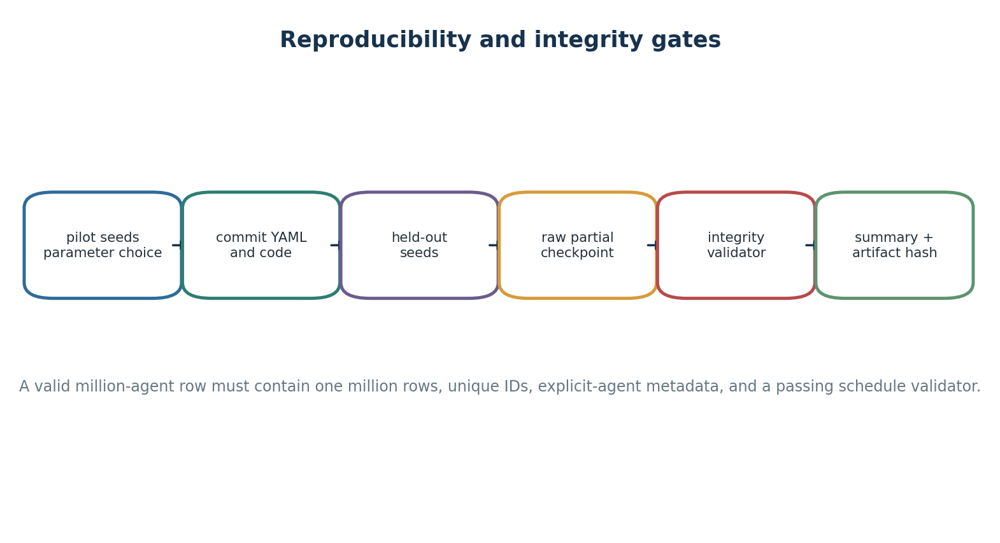</p>
<p align="center"><em>Reproducibility pipeline. Parameter choice, held-out execution, integrity validation, and artifact hashing are separate steps.</em></p>

A valid result should be rebuildable from committed code, configuration, explicit dataset generation, and a raw CSV. The README figures are generated from the included summary data by `scripts/generate_figures.py`.

### Structural conclusion

The contribution is a software architecture and an operational method:

1.  represent every schedulable agent explicitly;

2.  separate readiness from capacity selection;

3.  scan the million-row population in deterministic shards;

4.  reduce to a bounded candidate pool;

5.  run a mathematically correct sparse solver on that pool;

6.  enforce exact feasibility in a separate packer;

7.  execute all policies under identical simulator semantics;

8.  report execution quality and scheduling cost separately.

This structure is useful even when the final production policy is MP, OLS, a custom best-fit heuristic, or a hybrid. The main engineering gain is not a particular acronym. It is turning dispatch from an opaque queue operation into a measured, replaceable, and reproducible control-plane decision.


**Practitioner rule.**


The final rule is straightforward: keep FIFO until traces show fragmentation; deploy MP when fragmentation is real; add heavier solvers only when measured completion-time savings exceed their control-plane and operational cost.

## Evidence and benchmark results

### Frozen experimental question

The benchmark asks one narrow operational question:

> When a very large explicit population of heterogeneous agents is ready, does global resource-aware reordering reduce completion time relative to arrival-order dispatch under identical execution semantics?

It does not measure LLM answer quality, inference latency, API price, network transport, framework serialization, graph checkpointing, tool reliability, or model quality. Those are different systems questions.

### Positive stress and negative controls

The correlated-burst generator places independently perturbed resource families in long contiguous queue segments. The workload is deliberately favourable to global reordering because it creates head-of-line blocking. IID order randomizes the families. Complementary order deliberately interleaves them. A defensible scheduler must win in the first regime and stand down in the latter two.

| Regime | Method | Normalized makespan | Scheduler time (s) |
| --- | ---: | ---: | ---: |
| Correlated bursts | Adaptive-SPARSE | 1.242 ± 0.094 | 1.1018 |
| Correlated bursts | MP | 1.242 ± 0.094 | 1.0657 |
| Correlated bursts | FISTA | 1.249 ± 0.093 | 1.3951 |
| Correlated bursts | FIFO-Windowed | 2.475 ± 0.128 | 0.0038 |
| IID queue | Adaptive-SPARSE | 1.000 ± 0.000 | 0.0197 |
| IID queue | MP | 1.226 ± 0.098 | 1.0092 |
| IID queue | FISTA | 1.226 ± 0.098 | 1.3827 |
| IID queue | FIFO-Windowed | 1.000 ± 0.000 | 0.0017 |
| Complementary order | Adaptive-SPARSE | 1.008 ± 0.024 | 0.0177 |
| Complementary order | MP | 1.263 ± 0.076 | 1.0152 |
| Complementary order | FISTA | 1.263 ± 0.076 | 1.3760 |
| Complementary order | FIFO-Windowed | 1.008 ± 0.024 | 0.0016 |

<p align="center">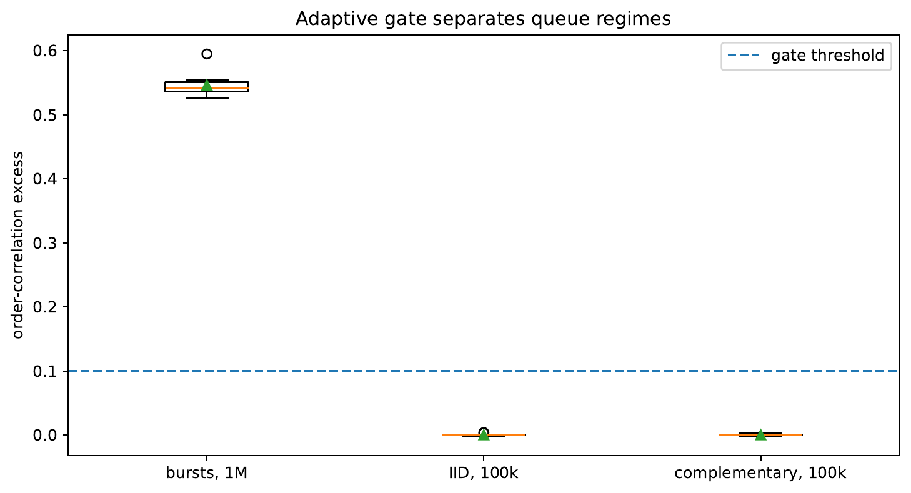</p>
<p align="center"><em>The order-correlation score separates the burst regime from IID and complementary controls.</em></p>

### Scaling from ten thousand to one million explicit agents

| Agents | Method | Normalized makespan | Scheduler time (s) |
| --- | ---: | ---: | ---: |
| 10,000 | Adaptive-SPARSE | 1.201 ± 0.099 | 0.196 ± 0.010 |
| 10,000 | MP | 1.201 ± 0.099 | 0.192 ± 0.010 |
| 10,000 | FISTA | 1.201 ± 0.099 | 0.225 ± 0.013 |
| 10,000 | IRLS | 1.257 ± 0.113 | 0.210 ± 0.012 |
| 10,000 | OMP | 1.478 ± 0.102 | 0.233 ± 0.018 |
| 10,000 | OLS | 1.478 ± 0.102 | 1.004 ± 0.079 |
| 10,000 | FIFO-Windowed | 2.499 ± 0.112 | 0.000 ± 0.000 |
| 100,000 | Adaptive-SPARSE | 1.242 ± 0.094 | 1.102 ± 0.067 |
| 100,000 | MP | 1.242 ± 0.094 | 1.066 ± 0.066 |
| 100,000 | FISTA | 1.249 ± 0.093 | 1.395 ± 0.075 |
| 100,000 | IRLS | 1.330 ± 0.071 | 1.350 ± 0.072 |
| 100,000 | OMP | 1.460 ± 0.166 | 1.139 ± 0.106 |
| 100,000 | OLS | 1.460 ± 0.166 | 3.004 ± 0.242 |
| 100,000 | FIFO-Windowed | 2.475 ± 0.128 | 0.004 ± 0.000 |
| 1,000,000 | Adaptive-SPARSE | 1.226 ± 0.079 | 9.586 ± 1.613 |
| 1,000,000 | MP | 1.226 ± 0.079 | 9.266 ± 1.534 |
| 1,000,000 | FISTA | 1.226 ± 0.078 | 10.944 ± 0.904 |
| 1,000,000 | IRLS | 1.287 ± 0.101 | 9.553 ± 0.883 |
| 1,000,000 | OMP | 1.355 ± 0.143 | 9.571 ± 1.764 |
| 1,000,000 | OLS | 1.355 ± 0.143 | 14.013 ± 2.533 |
| 1,000,000 | FIFO-Windowed | 2.451 ± 0.111 | 0.041 ± 0.027 |

<p align="center">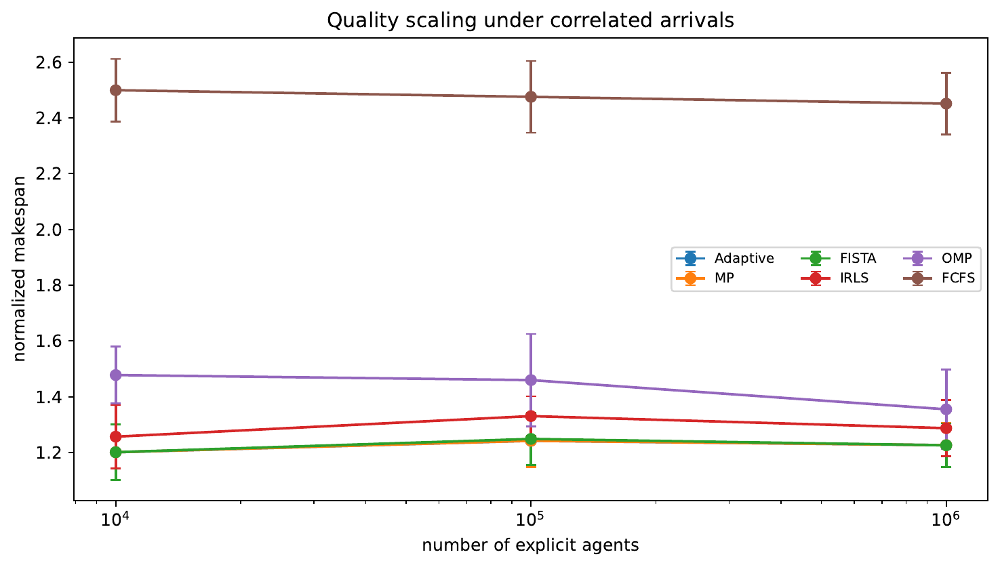</p>
<p align="center"><em>Quality scaling under correlated arrivals.</em></p>

<p align="center">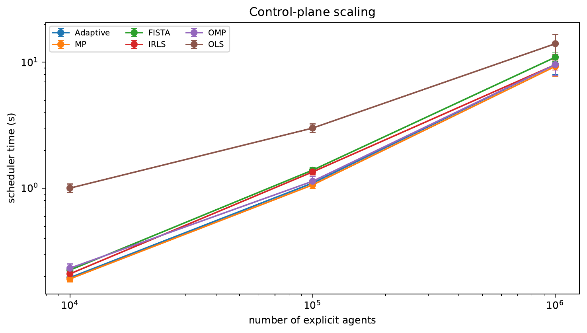</p>
<p align="center"><em>Control-plane cost grows with the explicit population and the selected solver.</em></p>

<p align="center">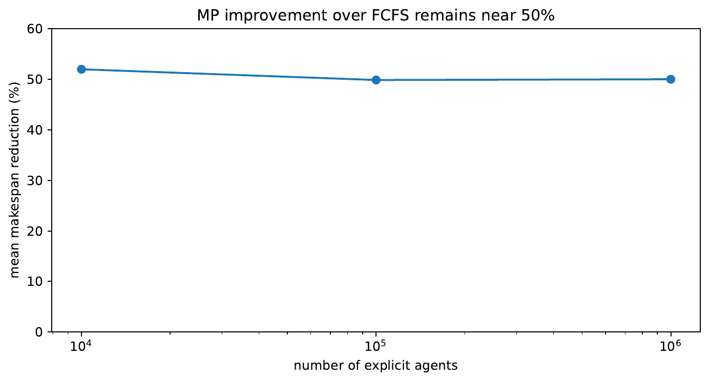</p>
<p align="center"><em>The MP improvement over FCFS remains near fifty percent across the tested correlated-burst scales.</em></p>

### Per-seed stability

<p align="center">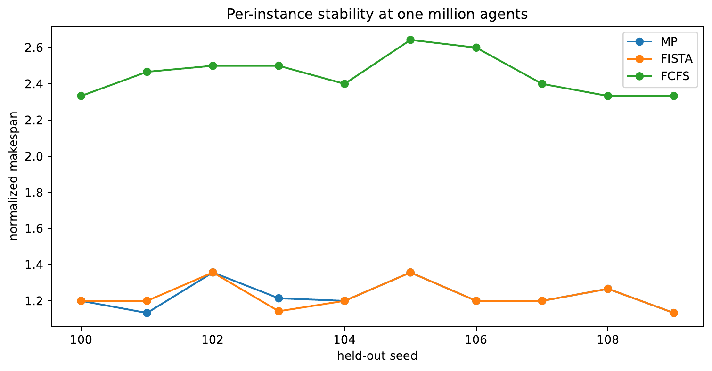</p>
<p align="center"><em>Per-instance completion quality for MP, FISTA, and windowed FCFS on the held-out million-agent seeds.</em></p>

### Exact small-instance certification

Small instances are solved by an exact mixed-integer formulation. Exact recovery is not expected to be perfect for every heuristic or every regime; the table shows where each policy reaches the certified optimum.

| Regime | Method | Exact recovery | Mean optimum ratio |
| --- | ---: | ---: | ---: |
| complementary | FIFO-Windowed | 60.0% | 1.200 ± 0.249 |
| complementary | FISTA | 50.0% | 1.250 ± 0.254 |
| complementary | IRLS | 50.0% | 1.250 ± 0.254 |
| complementary | MP | 50.0% | 1.250 ± 0.254 |
| complementary | OLS | 50.0% | 1.250 ± 0.254 |
| complementary | OMP | 50.0% | 1.250 ± 0.254 |
| correlated_bursts | FIFO-Windowed | 53.3% | 1.194 ± 0.219 |
| correlated_bursts | FISTA | 73.3% | 1.111 ± 0.192 |
| correlated_bursts | IRLS | 73.3% | 1.111 ± 0.192 |
| correlated_bursts | MP | 73.3% | 1.111 ± 0.192 |
| correlated_bursts | OLS | 73.3% | 1.111 ± 0.192 |
| correlated_bursts | OMP | 73.3% | 1.111 ± 0.192 |
| iid | FIFO-Windowed | 73.3% | 1.122 ± 0.210 |
| iid | FISTA | 66.7% | 1.150 ± 0.220 |
| iid | IRLS | 66.7% | 1.150 ± 0.220 |
| iid | MP | 66.7% | 1.150 ± 0.220 |
| iid | OLS | 66.7% | 1.150 ± 0.220 |
| iid | OMP | 66.7% | 1.150 ± 0.220 |

<p align="center">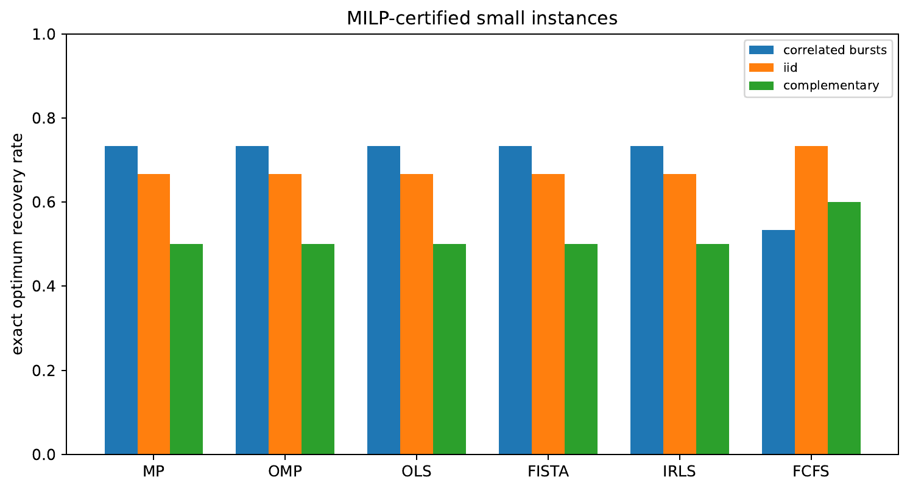</p>
<p align="center"><em>MILP-certified small-instance recovery across correlated, IID, and complementary regimes.</em></p>

### Candidate-pool ablation

The scalable scheduler does not run a million-column OLS or OMP refit. It retrieves a bounded global pool and applies the exact reference solver there. Pool size therefore controls a real quality-cost trade-off.

| Candidate pool | Normalized makespan | Scheduler time (s) |
| --- | ---: | ---: |
| 1,024 | 1.070 ± 0.003 | 1.437 ± 0.025 |
| 4,096 | 1.224 ± 0.082 | 0.950 ± 0.019 |
| 16,384 | 1.224 ± 0.096 | 1.162 ± 0.069 |
| 65,536 | 1.182 ± 0.067 | 4.255 ± 0.235 |

<p align="center">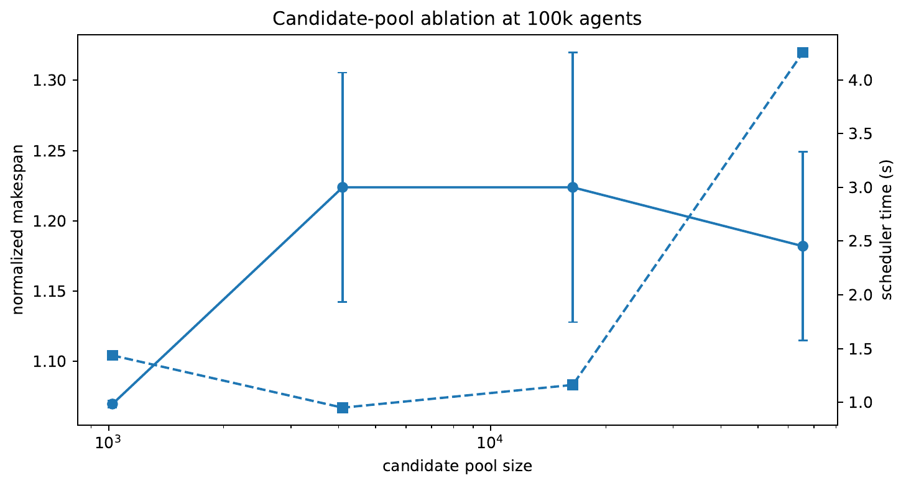</p>

### Process-backend measurement

The current process backend distributes candidate retrieval on one machine through shared memory maps. On the measured machine, startup and coordination overhead dominate at this pool size; more workers do not automatically mean lower wall time.

| Workers | Map-reduce wall time (s) | Map time (s) | Reduce time (s) | Deterministic checksum |
| --- | ---: | ---: | ---: | ---: |
| 1 | 0.209 ± 0.037 | 0.198 | 0.012 | 265611849 |
| 2 | 0.372 ± 0.037 | 0.345 | 0.027 | 265611849 |
| 4 | 0.287 ± 0.011 | 0.271 | 0.015 | 265611849 |
| 8 | 0.326 ± 0.062 | 0.307 | 0.017 | 265611849 |

<p align="center">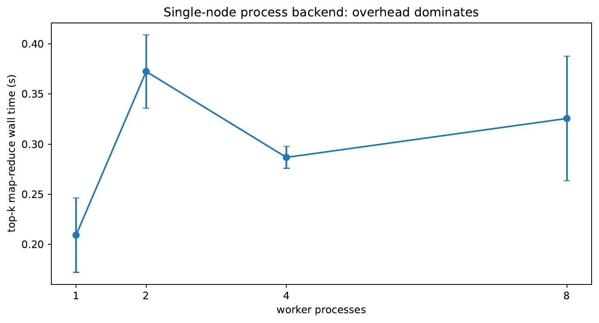</p>

### Quality-cost frontier

<p align="center">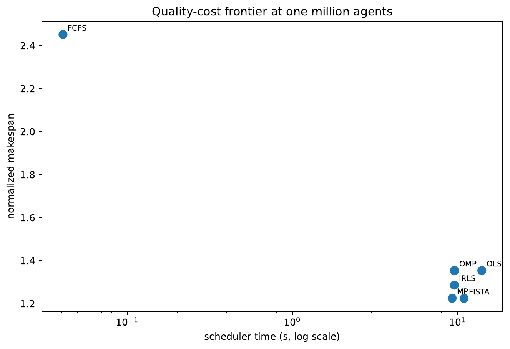</p>
<p align="center"><em>MP is the practical default in the favourable regime; OLS is more expensive, and the adaptive gate avoids paying any sparse-optimization cost when FCFS is already adequate.</em></p>

---

## Deep technical reference

The remainder of this README gives the formal model, algorithms, guarantees, experimental protocol, complete proofs, exact formulation, implementation details, and operational appendices. It is intentionally self-contained.

## Related Work

### Sparse approximation and pursuit

Sparse approximation, compressed sensing, and redundant representation provide the broader signal-processing context for the present construction. Matching pursuit represents a target by repeatedly selecting a dictionary atom correlated with the current residual. OMP recomputes the least-squares coefficients on the accumulated support and is central to sparse recovery theory. OLS instead evaluates the residual that would remain after adding each candidate and refitting the support. The distinction matters in coherent dictionaries: correlation and post-projection residual reduction need not rank candidates identically. Related greedy families include CoSaMP, iterative hard thresholding, and least-angle regression. They motivate useful extensions, but the present implementation focuses on methods whose selection or proximal steps map directly to a capacity residual and a deterministic launch ordering.

The scheduling dictionary considered here is highly coherent by construction. Agents belonging to the same resource family have nearly collinear demand vectors, while complementary families point toward different capacity coordinates. Classical support-recovery guarantees based on mutual coherence or restricted isometries are therefore not assumed. The goal is also different: the support need not recover an unknown ground truth. It must produce a capacity-feasible batch with low residual slack. We retain exact algebraic properties of pursuit, but evaluate scheduling quality directly.

Convex and nonconvex relaxations provide alternative rankings. FISTA accelerates proximal gradient descent for $\ell_1$-regularized least squares; its projection and proximal steps are standard constrained-optimization primitives. IRLS replaces a sparse penalty by a sequence of weighted quadratic problems, with the inner solves interpreted using standard numerical-optimization principles. Inverse-problem methods normally return a coefficient vector. A scheduler additionally needs a deterministic conversion from coefficients to an ordered, feasible set of indivisible agents. Our architecture therefore separates the continuous or greedy solver from a componentwise packer.

### Classical and cluster scheduling

Minimizing makespan under capacity constraints is a classical scheduling objective. The one-resource, unit-duration version already contains bin packing, and the residual-fitting subproblem is closely related to knapsack and multidimensional packing. Heterogeneous task scheduling methods such as HEFT prioritize critical paths and processor suitability; they address precedence and heterogeneous processors rather than a million-column admission decision within one provider partition.

Cluster systems separate resource allocation, placement, and execution in several ways. Mesos uses two-level resource offers; DRF defines fairness over multiple resource types; Omega uses shared-state optimistic concurrency; Borg operates large production clusters with admission control, priorities, and rescheduling; Quincy casts fair cluster scheduling as a graph optimization problem, and Gavel formulates heterogeneity-aware policies for accelerator workloads. These systems motivate multidimensional demand vectors and decentralized control, but they do not make sparse approximation the batch-selection primitive.

The relationship is complementary. A cluster manager may first assign a tenant, framework, or service a capacity vector. The selector in this repository then chooses which explicit agents belonging to that partition should consume the allocation. Fairness across tenants, preemption, data locality, and placement across machines can be placed outside or alongside the proposed selector.

### Topological and agent orchestration

Kahn’s algorithm maintains zero-indegree nodes and is the standard linear-time primitive for topological release. It determines which tasks are ready, not which resource-feasible subset should run. In a dependency-aware extension, Kahn release supplies the ready set and sparse selection supplies admission.

Contemporary agent libraries expose sequential, parallel, and graph execution abstractions. LangChain’s parallel runnable and LangGraph’s Pregel-style runtime support concurrent components and iterative graph execution. Their public APIs do not impose the FCFS policy used in our controlled baseline. Accordingly, this technical reference does not claim that a library is intrinsically unable to use a better scheduler. Rather, it shows what a resource-aware admission module can contribute to any runtime whose ready queue is large and heterogeneous.

### Distributed candidate reduction

MapReduce separates local map computations from an associative reduction. The top-$K$ operator has a useful compositional property: the global top $K$ is contained in the union of local top $K$ sets. This permits exact candidate retrieval with communication proportional to the number of shards and the retained local candidates, not to the million-agent population. Our process backend implements this decomposition over a memory-mapped demand matrix.

### Position of this repository

This technical reference is neither a new general-purpose cluster manager nor a new sparse-recovery theorem under random matrices. Its contribution lies in the correspondence between residual capacity and sparse representation, the scalable two-level implementation needed to make that correspondence operational at a million rows, and the adaptive evidence boundary that prevents optimization from being applied when a queue is already well mixed.

## System Model

### Explicit agents and provider capacity

There are $N$ explicit agents and $m$ resource dimensions. Agent $i$ has demand vector $$d_i=(d_{i1},\ldots,d_{im})^\top\in\mathbb{R}_+^m$$ and duration $p_i>0$. The provider exposes capacity $$c=(c_1,\ldots,c_m)^\top\in\mathbb{R}_{++}^m.$$ Every agent is individually feasible: $$d_i\preceq c,\qquad i=1,\ldots,N,
$$ where inequalities are componentwise. The demand matrix is stored by rows, $$D=[d_1^\top;\ldots;d_N^\top]\in\mathbb{R}_+^{N\times m},$$ because the dominant operation is a scan over candidate agents. In the sparse representation formulas it is convenient to use the column dictionary $A=D^\top$.

An explicit-agent experiment contains $N$ independent rows and identifiers. It does not replace the population by a small catalogue of repeated profiles. Correlated workload families are generated by perturbing cluster centers independently so that the rows remain distinct.

### Readiness, activity, and admission

Let $\mathcal{R}(t)$ be the ready set at time $t$. In the core experiments all agents are ready at $t=0$; precedence can be incorporated by letting Kahn release update $\mathcal{R}(t)$. The active set $\mathcal{A}(t)$ contains ready agents not yet launched. If running agents consume aggregate demand $u(t)$, the residual capacity is $$b(t)=c-u(t)\succeq0.$$ A dispatch batch $S\subseteq\mathcal{A}(t)$ is feasible if $$\sum_{i\in S}d_i\preceq b(t).
$$

### Wave schedule

For unit or equal durations, a wave schedule is an ordered partition $S_1,\ldots,S_T$ of $\{1,\ldots,N\}$ such that $$\sum_{i\in S_t}d_i\preceq c,\qquad t=1,\ldots,T.$$ The makespan is $T p$ when every duration equals $p$. The unit-duration problem minimizes $T$.

**Definition.**

The minimum number of feasible waves is denoted $T^\star(D,c)$.

### Event schedule

For heterogeneous durations, agent $i$ starts at $s_i\ge0$ and finishes at $f_i=s_i+p_i$. Feasibility requires $$\sum_{i:s_i\le t<f_i}d_i\preceq c\quad\text{for all }t\ge0.$$ The event makespan is $\max_i f_i$. The implementation advances to the next completion event, releases the corresponding resources, and invokes the same batch scheduler on the remaining active set.

### Objectives

The primary objective is completion time. Secondary quantities include scheduler computation, mean and minimum resource utilization, number of dispatch calls, scanned agents, candidate-pool size, and memory footprint. The benchmark deliberately reports execution quality and control-plane cost separately. A policy that computes in microseconds but doubles makespan and a policy that saves one wave after hours of optimization represent different failure modes.

### Normalization

Define normalized demands and residual capacity by $$\tilde d_i=\operatorname{diag}(c)^{-1}d_i,\qquad \tilde b=\operatorname{diag}(c)^{-1}b.$$ Then batch feasibility is $\sum_{i\in S}\tilde d_i\preceq\tilde b$. Normalization makes resource coordinates dimensionless and prevents the units of one capacity from dominating a Euclidean residual solely by scale.

<p align="center">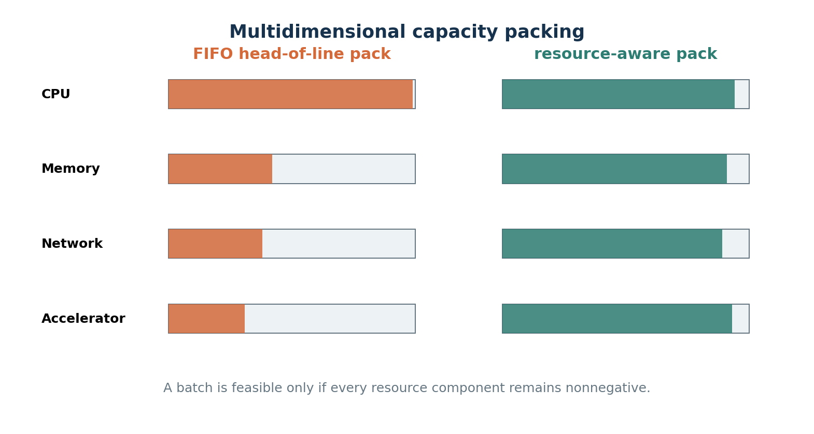</p>
<p align="center"><em>A launch decision packs heterogeneous resource vectors into residual provider capacity. Correlated queue segments can saturate one coordinate while leaving others idle.</em></p>

### Notation

For an index set $S$, $A_S$ is the subdictionary containing columns in $S$. $H_K(v)$ keeps the $K$ largest entries of $v$ under a deterministic tie rule. $\operatorname{TopK}_K(\{(i,s_i)\})$ denotes the corresponding indexed top-$K$ set. The support of $x$ is $\operatorname{supp}(x)$. A complete notation table appears in Appendix.

## Computational Hardness and Lower Bounds

The sparse formulation is useful because the exact scheduling problem is combinatorial even before dependencies, failures, or placement constraints are introduced.

**Theorem.**

Given nonnegative demands $D$, capacity $c$, and integer $T$, deciding whether all unit-duration agents can be completed in at most $T$ waves is strongly NP-complete. The statement holds for one resource.

**Proof.**

*Proof.* Membership in NP follows because a proposed wave assignment can be checked in polynomial time. Strong NP-hardness follows from 3-PARTITION. Given integers $a_1,\ldots,a_{3q}$ and $B$ satisfying $B/4<a_i<B/2$ and $\sum_i a_i=qB$, create one unit-duration agent of scalar demand $a_i$, scalar capacity $B$, and ask whether $T=q$. Any feasible wave contains at most three items because four exceed capacity, and at least three because $3q$ items must occupy $q$ waves. Hence every wave contains exactly three items and, because total demand equals $qB$, each wave sums exactly to $B$. Such a schedule exists if and only if the integers admit a 3-partition. The reduction is strong. Full details are in Appendix. ◻

**Theorem.**

For one resource, deciding whether there is a feasible binary selection $x$ with zero residual $b-Ax=0$ is NP-complete.

**Proof.**

*Proof.* This is SUBSET-SUM: the columns are the positive integers and the target is the requested sum. Feasibility $Ax\le b$ and zero residual together require equality. ◻

**Corollary.**

The exact binary problem $$\min_{x\in\{0,1\}^n}\frac12\lVert b-Ax \rVert_2^2\quad\text{s.t. }Ax\preceq b
$$ is NP-hard, even for $m=1$.

### Resource-time lower bounds

Let $W_r=\sum_i d_{ir}$ be total demand in resource $r$. Every wave provides at most $c_r$ units of that resource.

**Theorem.**

Every unit-duration schedule satisfies $$T^\star(D,c)\ge L_{\rm wave}:=\left\lceil\max_{1\le r\le m}\frac{W_r}{c_r}\right\rceil.
$$

**Proof.**

*Proof.* Summing capacity usage over $T$ waves gives $W_r\le Tc_r$ for every $r$. Rearrangement and integrality yield the result. ◻

For heterogeneous durations define resource-time work $Q_r=\sum_i d_{ir}p_i$.

**Theorem.**

Every nonpreemptive event schedule has makespan $$C_{\max}\ge L_{\rm event}:=\max\left\{\max_r\frac{Q_r}{c_r},\ \max_i p_i\right\}.$$

The proof integrates capacity use over time and observes that every job must fit within the makespan.

### Lower bound and utilization

Choose a bottleneck coordinate $r^\star\in\argmax_r W_r/c_r$. For a schedule of $T$ unit waves, its average utilization on that coordinate is $$\bar u_{r^\star}=\frac{W_{r^\star}}{Tc_{r^\star}}.$$ Consequently, $$T=\frac{W_{r^\star}/c_{r^\star}}{\bar u_{r^\star}}.
$$ Apart from the ceiling in $L_{\rm wave}$, normalized makespan is the reciprocal of bottleneck utilization. This identity explains why resource-direction mixing is directly connected to completion time.

### Why an approximation architecture is necessary

The hardness results do not justify arbitrary heuristics. They justify decomposing the problem into components with auditable guarantees: a global retrieval stage, a sparse optimizer on a bounded pool, and a packer that never violates capacity. The optimizer may be approximate; feasibility and progress need not be.

## Scheduling as Sparse Approximation

### Binary residual-capacity model

At one dispatch decision, let $n=|\mathcal{A}|$ and let $A\in\mathbb{R}_+^{m\times n}$ contain normalized active demands. Let $b\in[0,1]^m$ be normalized residual capacity. A binary vector $x\in\{0,1\}^n$ selects a batch. A basic objective is $$\min_x \frac12\lVert b-Ax \rVert_W^2-\eta q^\top x
\quad\text{s.t. }Ax\preceq b,\quad x\in\{0,1\}^n,
$$ where $W\succeq0$ weights resource coordinates and $q$ may encode priority, age, criticality, or release value. The implementation studied experimentally uses $W=I$ and resource-fit proxy scores; the priority term is included to show how service objectives enter without changing feasibility.

The vector $x$ is sparse because finite capacity admits only a subset of the ready population. Unlike classical inverse problems, sparsity is not merely a prior: it is an operational fact. Nevertheless, the dictionary geometry is useful. A residual points toward underused resources; columns aligned with it are natural candidates.

### Continuous relaxations

The nonnegative $\ell_1$ relaxation is $$\min_{x\ge0}F_1(x):=\frac12\lVert Ax-b \rVert_2^2+\lambda\lVert x \rVert_1.
$$ The smoothed $\ell_p$ model, $0<p\le1$, is $$\min_{x\ge0}F_{p,\epsilon}(x):=\frac12\lVert Ax-b \rVert_2^2+
\lambda\sum_{j=1}^n(x_j^2+\epsilon^2)^{p/2}.
$$ The coefficient vector is a ranking object, not a fractional execution plan. Agents remain indivisible. After solving, coefficients are ordered and passed to the exact packer.

### Direction-first interpretation

At million-column scale, solving over every agent at every dispatch is unnecessary and expensive. The implementation treats the sparse solver as a selector of resource directions. Candidate retrieval first forms a pool $P$. The solver identifies a small directional support $S\subseteq P$. Every pool agent is then scored by a mixture of its map proxy and its cosine affinity to the selected directions. This makes the sparse support a compact description of which demand geometries are currently useful.

<p align="center"></p>
<p align="center"><em>Residual capacity is the target signal. Candidate demand vectors form a nonnegative dictionary. Sparse pursuit selects directions that collectively approach the target, after which exact packing enforces indivisibility and componentwise capacity.</em></p>

### Map-stage proxies

For normalized demand $a_i$ and target $b$, the implementation uses the following retrieval proxies: $$\begin{aligned}
s_i^{\rm MP}&=a_i^\top b,\\
s_i^{\rm OMP}&=\frac{a_i^\top b}{\lVert a_i \rVert_2+\varepsilon},\\
s_i^{\rm OLS}&=\frac{[a_i^\top b]_+^2}{\lVert a_i \rVert_2^2+\varepsilon}.
\end{aligned}$$ FISTA and IRLS use correlation with mild concentration penalties to produce a useful warm pool. These are retrieval scores, not substitutes for the reference solvers. Exact MP, OMP, OLS, FISTA, or IRLS runs only after reduction.

### Separation of policy and feasibility

A common implementation error is to hide a strong best-fit heuristic inside the packer and then attribute its performance to the named sparse method. We avoid that ambiguity. The solver owns the ranking; the packer only traverses the supplied order, accepts feasible agents, and optionally revisits rejected agents without changing the fundamental priority. This separation permits unit tests for solver correctness and capacity correctness independently.

## Exact Packing and Execution Semantics

### Deterministic componentwise packer

Given a candidate order $\pi$, the packer initializes residual $r=b$ and accepts candidate $\pi_j$ if $d_{\pi_j}\preceq r$, updating $r\leftarrow r-d_{\pi_j}$. It never changes the candidate order during the first pass. A bounded refinement pass may revisit rejected candidates using residual-scaled scores, but every acceptance is checked against the exact original demand vector in Float64 accumulation.

**Theorem.**

Every batch returned by the packer satisfies.

**Proof.**

*Proof.* The residual is initialized at $b$ and is decreased only by a demand vector componentwise no larger than the current residual. Induction over accepted agents gives a nonnegative final residual and hence feasibility. ◻

**Theorem.**

Assume every active agent is individually feasible under full provider capacity. At the beginning of an empty wave, the complete scheduler launches at least one agent.

**Proof.**

*Proof.* At the beginning of a wave, residual capacity equals $c$. Any active agent is feasible by. If the main ranking produces an empty batch, the deterministic fallback tests the highest-ranked pool member. Candidate retrieval includes feasible members whenever the active set is nonempty; therefore at least one is launched. If retrieval itself returns no feasible agent, the backend has violated its contract and the simulator raises an error rather than silently looping. ◻

### Wave simulator

Within a wave, the simulator may call the scheduler repeatedly on the residual left by earlier dispatch batches. When no additional batch fits, the wave completes, all resources are released, and the next wave begins. Agent lifecycle masks ensure that no agent is launched twice.

**Theorem.**

If every dispatch batch passes the validator and the scheduler satisfies progress, the wave simulator terminates after finitely many waves with a feasible partition of all agents.

At least one active agent is removed per wave, so there are at most $N$ waves. Feasibility follows by summing only batches accepted against the current residual.

### Event simulator

In event mode, accepted agents are inserted into a completion heap. At the next event time, all agents finishing within a numerical tolerance release their resources. The scheduler is invoked whenever capacity becomes available. The simulator integrates resource use over each inter-event interval to compute utilization and the event lower bound.

<p align="center"></p>
<p align="center"><em>Wave mode isolates packing quality under equal durations. Event mode releases resources at individual completion times and is appropriate for heterogeneous durations.</em></p>

### Validation as part of the algorithm

The implementation rejects negative or nonfinite demands, inconsistent dimensions, duplicate resource names, agents larger than capacity, duplicate batch indices, inactive selections, and negative residual capacity beyond tolerance. A large experiment is accepted only if the completed count equals the explicit row count and all validators pass.

### Amortized control-plane condition

Let a baseline require $T_b$ waves and a sparse policy require $T_s$ waves. If one wave of execution takes physical time $\tau$ and the additional scheduler cost is $C_{\rm sched}$, sparse scheduling reduces end-to-end latency whenever $$C_{\rm sched}<(T_b-T_s)\tau.
$$ For remote model calls, tool use, or GPU kernels, $\tau$ can be orders of magnitude larger than seconds of provider-side scheduling. For microtasks, FCFS may remain preferable even when its wave count is worse.

## Greedy Sparse Schedulers

### Matching pursuit

For a dictionary $A=[a_1,\ldots,a_K]$ and residual $r_0=b$, positive MP selects $$j_t\in\argmax_{j\notin S_t}[a_j^\top r_t]_+,$$ uses step $$\alpha_t=\frac{[a_{j_t}^\top r_t]_+}{\lVert a_{j_t} \rVert_2^2},$$ and updates $r_{t+1}=r_t-\alpha_ta_{j_t}$. Reselection is disabled in the scheduler so that the support corresponds to distinct candidate directions.

**Lemma.**

If $a_{j_t}^\top r_t>0$, then $$\lVert r_{t+1} \rVert_2^2=\lVert r_t \rVert_2^2-
\frac{(a_{j_t}^\top r_t)^2}{\lVert a_{j_t} \rVert_2^2}.
$$

This exact identity makes normalized correlation the natural one-step criterion.

<p align="center"></p>
<p align="center"><em>MP follows residual capacity one selected direction at a time and does not refit earlier coefficients.</em></p>

### Orthogonal matching pursuit

OMP selects by correlation but refits all active coefficients: $$\begin{aligned}
j_t&\in\argmax_{j\notin S_t}[a_j^\top r_t]_+,\\
S_{t+1}&=S_t\cup\{j_t\},\\
x_{S_{t+1}}&\in\argmin_{z\ge0}\lVert b-A_{S_{t+1}}z \rVert_2^2,\\
r_{t+1}&=b-A_{S_{t+1}}x_{S_{t+1}}.
\end{aligned}$$ The nonnegative refit reflects the fact that an agent cannot contribute negative demand.

**Theorem.**

The OMP residual norms are nonincreasing. If the newly added column enlarges the feasible approximation cone in a direction that improves the projection, the decrease is strict.

The previous coefficient vector extended by zero remains feasible in the enlarged nonnegative least-squares problem, so the optimum cannot be worse.

<p align="center"></p>
<p align="center"><em>OMP alternates correlation selection with a full nonnegative refit on the selected directions.</em></p>

### Orthogonal least squares

OLS evaluates every candidate after refitting: $$j_t\in\argmin_{j\notin S_t}\min_{z\ge0}
\lVert b-A_{S_t\cup\{j\}}z \rVert_2^2.$$ This is more expensive than OMP but has an immediate local optimality property.

**Theorem.**

Fix a current support $S_t$. Let $j_{\rm OMP}$ be the OMP candidate and $j_{\rm OLS}$ the OLS candidate. After the respective nonnegative refits, $$\lVert r_{t+1}^{\rm OLS} \rVert_2\le\lVert r_{t+1}^{\rm OMP} \rVert_2.$$

The theorem concerns the continuous residual on a common candidate pool. It does not imply that the final indivisible packed schedule from OLS always dominates OMP, because ranking and capacity rejection intervene after the solve. The experiments confirm this distinction.

<p align="center"></p>
<p align="center"><em>OLS tests the post-refit residual of every candidate in the bounded direction pool.</em></p>

### Approximate retrieval

Let $g_j=[a_j^\top r]_+/\lVert a_j \rVert_2$. Suppose candidate retrieval returns $\hat j$ satisfying $g_{\hat j}\ge(1-\delta)\max_j g_j$. Combining this with Lemma gives the following bound.

**Proposition.**

The one-step squared-residual decrease obtained from $\hat j$ is at least $(1-\delta)^2$ times the best MP one-step decrease over the full active set.

This proposition separates retrieval quality from sparse-solver correctness.

### Greedy scheduling algorithm

Algorithm gives the complete dispatch routine.


**Algorithm.**


active set $\mathcal{A}$, demands $D$, residual capacity $b$, method $M$, pool sizes $k,K$ partition $\mathcal{A}$ into deterministic shards remove agents not fitting $b$ compute proxy scores for $M$ emit local top $k$ index-score pairs reduce emitted pairs to stable global top $K$ pool $P$ run exact MP, OMP, or OLS on normalized directions in $P$ score every member of $P$ by proxy and selected-direction affinity pack candidates in descending score order under exact capacity launch the highest-ranked feasible candidate feasible explicit-agent batch

## FISTA and IRLS Schedulers

### Nonnegative FISTA

Write $$f(x)=\frac12\lVert Ax-b \rVert_2^2,
\qquad g(x)=\lambda\lVert x \rVert_1+I_{\mathbb{R}_+^K}(x),$$ where $I$ is the convex indicator. The gradient $\nabla f(x)=A^\top(Ax-b)$ is Lipschitz with constant $L=\lVert A \rVert_2^2$. A proximal step is positive soft thresholding, $$\operatorname{prox}_{g/L}(v)=\max\{v-\lambda/L,0\}.$$ The implementation uses Nesterov momentum, objective restart, and gradient restart.

**Theorem.**

Let $x^\star$ minimize. For the standard FISTA sequence with step $1/L$, $$F_1(x_k)-F_1(x^\star)\le
\frac{2L\lVert x_0-x^\star \rVert_2^2}{(k+1)^2}.$$

The positivity constraint is included in the proximal function and does not alter the classical proof.

<p align="center"></p>
<p align="center"><em>FISTA solves a convex nonnegative sparse relaxation on the reduced candidate pool and passes its coefficients to the deterministic packer.</em></p>

### IRLS

For $0<p\le1$, IRLS majorizes each smoothed penalty term by a quadratic. At outer iteration $k$, define $$w_j^{(k)}=((x_j^{(k)})^2+\epsilon_k^2)^{p/2-1}.$$ The next iterate approximately solves $$\left(A^\top A+\lambda\frac p2\operatorname{diag}(w^{(k)})\right)x=A^\top b,
$$ followed by projection onto the nonnegative orthant. The linear system is solved by warm-started inexact conjugate gradients with a continuation schedule for $\epsilon_k$.

**Theorem.**

If each quadratic majorizer is minimized exactly and the smoothing parameter is fixed, the smoothed objective $F_{p,\epsilon}(x_k)$ is nonincreasing.

**Proposition.**

Let $Q_k$ be the quadratic majorizer and suppose the computed update satisfies $$Q_k(x_{k+1})\le Q_k(x_k)-\gamma_k,
\qquad \gamma_k\ge0.$$ Then $F_{p,\epsilon}(x_{k+1})\le F_{p,\epsilon}(x_k)-\gamma_k$. Thus early-stopped CG preserves descent whenever it reduces the surrogate.

The implementation records CG iterations but does not claim that every finite-precision inner solve reaches a global minimizer of the nonconvex objective.

<p align="center"></p>
<p align="center"><em>IRLS alternates reweighting with inexact conjugate-gradient solves. The repeated global linear-algebra steps make it less communication-friendly than MP.</em></p>

### Coefficient-to-batch conversion

FISTA and IRLS return continuous coefficients. Let $x$ be the result and $s$ the map proxy. The implementation forms $$\rho_i=\frac{x_i}{\max_j|x_j|+\varepsilon}+10^{-4}\,\bar s_i,$$ where $\bar s$ is min-max normalized. Agents are sorted by $\rho_i$ and passed to the same two-pass feasibility packer used by the pursuit methods. The small proxy term resolves near-zero coefficient ties without changing the optimization problem.

### Why continuous dominance need not imply scheduling dominance

OLS has a one-step residual advantage, and FISTA has a convex objective guarantee, but the final schedule is governed by three nonlinear operations: candidate truncation, coefficient-to-order conversion, and indivisible packing. A method can therefore have a smaller continuous residual yet produce more waves. This is not a contradiction; it is the central difference between sparse approximation as an optimization subroutine and scheduling as the end-to-end task.

## Adaptive Activation of Sparse Scheduling

The negative controls in Section show that unconditional reordering is not a safe default. We therefore estimate whether queue order contains resource-direction correlation.

### Order-correlation excess

Normalize each demand direction, $$y_i=\frac{\tilde d_i}{\lVert \tilde d_i \rVert_2}.$$ For a sample of $M$ queue entries, define adjacent similarity $$C_{\rm adj}=\frac{1}{M-1}\sum_{i=1}^{M-1}y_i^\top y_{i+1}.$$ Draw $M$ independent index pairs $(I_j,J_j)$ uniformly from the ready population and define $$C_{\rm rnd}=\frac1M\sum_{j=1}^M y_{I_j}^\top y_{J_j}.$$ The gate statistic is $$G_M=C_{\rm adj}-C_{\rm rnd}.
$$ The policy activates MP when $G_M>\theta$ and otherwise uses windowed FCFS. The experiments fix $M=50{,}000$ and $\theta=0.1$ using disjoint pilot seeds.

**Proposition.**

If the queue directions are IID, then $\mathbb{E} G_M=0$ up to the negligible difference between sampling with and without replacement.

The adjacent pair has the same product distribution as an independent random pair.

**Proposition.**

Suppose the queue consists of long blocks generated by latent resource family $Z$, and let $\mu_{\rm in}=\mathbb{E}[y_i^\top y_{i+1}\mid Z_i=Z_{i+1}]$ and $\mu_{\rm out}=\mathbb{E}[y_I^\top y_J]$. If a sampled adjacent pair lies within a block with probability $\pi$, then $$\mathbb{E} G_M=\pi(\mu_{\rm in}-\mu_{\rm out})+\epsilon_M,$$ where $\epsilon_M$ accounts for block boundaries and finite-population sampling. Thus the gate has positive mean whenever within-family directions are more similar than random pairs.

**Theorem.**

Consider the variant of $C_{\rm adj}$ using disjoint pairs $(y_1,y_2),(y_3,y_4),\ldots$. Since cosine similarities lie in $[-1,1]$, for independent blocks and random pairs, $$\mathbb{P}(|G_M-\mathbb{E} G_M|\ge t)\le4\exp(-cMt^2)$$ for a universal constant $c>0$.

The practical statistic uses all adjacent pairs to reduce variance; the theorem supplies a conservative justification using an independent subsequence.

### Adaptive policy


**Algorithm.**


explicit ready queue, sample size $M$, threshold $\theta$ compute $G_M$ from invoke sharded MP scheduling invoke windowed FCFS

**Theorem.**

Let $T_{\rm MP}$ and $T_{\rm F}$ be the makespans of MP and FCFS on a workload, and let $T_{\rm A}$ be the adaptive makespan. If the gate chooses the smaller of the two with probability at least $1-\delta$, then $$\mathbb{E} T_{\rm A}\le \mathbb{E}\min\{T_{\rm MP},T_{\rm F}\}+\delta\,\mathbb{E}|T_{\rm MP}-T_{\rm F}|.$$

The result states exactly what the gate can and cannot do: it approaches the better policy only to the extent that queue-regime classification is reliable.

<p align="center"></p>
<p align="center"><em>The order-correlation statistic cleanly separates held-out burst queues from IID and already-complementary controls. The threshold was fixed before the reported seeds.</em></p>

## Distributed Candidate Retrieval

### Top-$K$ decomposition

Partition the active indices into shards $I_1,\ldots,I_P$. Mapper $p$ computes scores on $I_p$ and emits its local top $k$. The reducer computes the global top $K$ over the union.

**Theorem.**

If every mapper emits at least its local top $K$ under the same deterministic total order, then $$\operatorname{TopK}_K\left(\bigcup_{p=1}^P I_p\right)=
\operatorname{TopK}_K\left(\bigcup_{p=1}^P\operatorname{TopK}_K(I_p)\right).$$

If an item is globally top $K$ but not locally top $K$, its shard contains at least $K$ items ranked above it, contradicting global membership.

**Corollary.**

A local chunked backend and a process backend return identical candidate indices and scores when they use the same shards, scoring function, local retention, global retention, and tie rule.

### Complexity

With balanced shards, fixed resource dimension $m$, active population $N_a$, and local retention $k$, map computation is $$O\!\left(\frac{N_am}{P}\right)$$ per worker. Central reduction receives at most $Pk$ pairs and costs $O(Pk\log(Pk))$ with comparison sorting, or $O(Pk\log K)$ with a heap. Communication is $O(Pk)$ identifiers and scores. The demand matrix remains shared or memory mapped and is not transmitted.

### Distributed sparse solves

MP, OMP, and OLS are distributed primarily through candidate retrieval; the exact reduced solve is intentionally centralized because $K$ and the direction budget are bounded. FISTA and IRLS could distribute matrix-vector products, but every proximal or CG iteration then requires collective communication. This synchronization burden is why the implementation keeps their reduced problems local.

<p align="center"></p>
<p align="center"><em>Map workers scan disjoint explicit-agent shards and emit only local top candidates. A deterministic reducer constructs the exact global pool.</em></p>

### Single-node process behavior

The process backend is designed for memory isolation and multi-node extension, not guaranteed speedup on a single machine. In our one-million-row top-$K$ microbenchmark, local vectorized scanning is faster than 2–8 worker processes because process startup, task serialization, page faults, and reduction dominate. All worker counts return the same checksum, validating exact reduction. This negative result prevents an unsupported claim that “distributed” automatically means faster.

### Fault and ownership model

A production deployment should assign each scheduling partition to one logical owner. Multiple active orchestrator replicas require leases, transactional queue claims, or an external leader; otherwise two schedulers can launch the same agent. Candidate maps are retryable because they are pure functions of a versioned active-set snapshot and residual vector. Dispatch commit is not pure and must be fenced.

## End-to-End Properties

This section composes the local results into properties of the complete orchestrator.

**Theorem.**

Assume valid input arrays, an exact active-set snapshot, a candidate backend that returns only active individually feasible agents, and the componentwise packer. Every committed dispatch is capacity feasible and contains no duplicate or inactive agent.

The backend restricts the domain, the ranking only orders it, and Theorem enforces capacity. The commit validator checks uniqueness and active membership.

**Theorem.**

Under the hypotheses of Theorem and individual feasibility, the orchestrator completes all $N$ agents in at most $N$ waves.

This is a safety and liveness statement, not an approximation ratio.

**Proposition.**

If the reduced pool contains an atom whose normalized MP score is at least $(1-\delta)$ of the full-set maximum at each sparse direction update, then each reduced MP step obtains at least $(1-\delta)^2$ of the best full-set one-step squared-residual reduction.

The proposition motivates measuring candidate recall and pool-size ablations rather than treating $K$ as an arbitrary engineering constant.

**Proposition.**

Let $C_M$ and $C_F$ be scheduler costs and $T_M<T_F$ be wave counts for MP and FCFS. MP has lower total completion time whenever $$\tau>\frac{C_M-C_F}{T_F-T_M}.$$ For the million-agent means, this threshold is well below one second per wave; nevertheless, workloads composed of microsecond tasks should not use the heavy control path.

### What is not proved

No constant-factor approximation ratio is claimed for the complete sparse scheduler on arbitrary multidimensional bin-packing instances. Continuous residual quality does not fully determine integer wave count, and candidate truncation can exclude globally useful agents. This technical reference instead provides exact subroutine properties, safe composition, an adaptive workload gate, and empirical scheduling evidence under explicitly defined regimes.

### The signal-processing interpretation

The main conceptual statement can now be made precisely. Provider capacity is a short, nonnegative signal of dimension $m$. The ready population is a large redundant dictionary. Dispatch chooses a sparse representation subject to one-sided feasibility. Candidate retrieval is approximate nearest-direction search; pursuit or proximal optimization estimates a representation; and packing maps the representation back to indivisible actions. The formulation imports useful mathematical machinery without pretending that scheduling is identical to classical noiseless support recovery.

## Reference Implementation

### Module boundaries

The Apache-2.0 repository mirrors the mathematical decomposition. The data model defines providers, agent arrays, dispatch batches, results, and validation errors. The generator creates explicit correlated, IID, and complementary workloads. Scoring contains map-stage proxies and direction affinity. The solvers directory contains reference MP, OMP, OLS, FISTA, and IRLS implementations. The schedulers directory embeds those solvers in scalable candidate-reduction policies. Packing owns exact feasibility. The simulator owns execution semantics. Storage owns memory maps and active masks. Reporting writes raw, partial, summary, and metadata artifacts.

<p align="center"></p>
<p align="center"><em>The control plane scans and ranks agents; the data plane executes only committed feasible batches.</em></p>

### Command-line workflow

A reproducible run proceeds through generation, inspection, execution, summary, and validation:

    sparse-orchestrator generate configs/million_agents.yaml data/million --overwrite
    sparse-orchestrator inspect data/million --sample 100000
    sparse-orchestrator run configs/million_agents.yaml
    sparse-orchestrator summarize results/million_agents/raw.csv \
        --output results/million_agents/summary.csv
    python scripts/validate_results.py results/million_agents/raw.csv \
        --agents 1000000

The process backend is selected in YAML and requires a memory-mapped demand matrix so that spawned workers do not copy the million-row array.

### Numerical choices

Demand storage uses Float32 to reduce memory bandwidth; feasibility accumulation and solver arithmetic use Float64. Ties use stable sorting and global identifiers. Residual values within $10^{-10}$ of zero are clipped to zero, while substantive negative capacity raises an error. OMP and OLS use nonnegative least squares with a small ridge term. FISTA estimates the spectral norm to choose its step. IRLS uses continuation in the smoothing parameter and a bounded CG schedule.

### Partial results and failure recovery

After every completed method, the benchmark runner rewrites a partial CSV. An interrupted million-agent run therefore retains completed rows. Configurations and raw results are immutable inputs to aggregation; summaries and figures are regenerated. A production orchestrator would additionally persist active-set versions and dispatch commits in a transactional state store.

<p align="center"></p>
<p align="center"><em>Reference provider-side deployment. High availability requires single logical ownership of each scheduling partition.</em></p>

### Complexity in practice

The dominant cost is repeated scanning of active rows. With a fixed number of waves and fixed $m$, total map work is roughly linear in $N$. OLS adds a bounded but large direction-pool evaluation cost. FISTA and IRLS add dense reduced-pool matrix-vector operations. The experiments show that these constants matter: OLS is not justified by its continuous one-step property in the current schedule.

## Experimental Protocol

### Frozen questions

The experiments address five questions.

1.  Does sparse reordering reduce waves when arrival order contains long resource-correlated bursts?

2.  Does the gain persist from $10^4$ to $10^6$ explicit agents?

3.  What happens when order is IID or already complementary?

4.  How close are the methods to exact MILP optima on small instances?

5.  How do candidate-pool size and process-based map reduction affect quality and control-plane cost?

### Explicit workload generation

Every large instance contains one row per agent and a unique 64-bit identifier. There are four resource dimensions and eight latent resource families. A family has one dominant coordinate, a correlated secondary coordinate, and small background demands. Each row receives independent lognormal multiplicative jitter and independent additive jitter, so no profile catalogue is repeated.

The positive stress regime, `correlated_bursts`, places each family in a long contiguous segment. The IID control samples family labels independently at every queue position. The complementary control balances families and shuffles the order. All large experiments use unit durations to isolate admission and packing; event-mode support is implemented but is not used to inflate the evidence beyond the completed benchmark.

<p align="center"></p>
<p align="center"><em>Correlated bursts create long queue segments with the same dominant resource. FCFS repeatedly encounters similar vectors; global selection can interleave complementary families.</em></p>

### Scale and capacities

The scale study uses $N\in\{10^4,10^5,10^6\}$. Capacity is scaled linearly with $N$ so that the expected number of waves remains comparable; this isolates scheduler scaling rather than trivially increasing congestion. The million-agent capacity is $(3\times10^6)\mathbf{1}$ in the native demand units.

### Methods

The resource-aware rows are Adaptive-SPARSE, MP, OMP, OLS, FISTA, and IRLS. Baselines are strict FCFS, windowed FCFS, and Kahn-FIFO; LangChain- and LangGraph-policy rows use the same windowed FCFS dispatch under the common simulator and are reported only in full tables. They are not framework runtime measurements.

### Parameter selection

Algorithmic parameters are fixed in the committed YAML. For one million agents, the global pool size is 65,536, local retention is 16,384, chunk size is 131,072, direction budget is 12, FISTA uses $\lambda=0.025$ and at most 64 iterations, and IRLS uses $p=0.5$, eight outer iterations, and at most 32 inner CG steps. The adaptive threshold $0.1$ is selected from pilot seeds 90–99; reported results use seeds 100–109.

### Metrics

Normalized makespan is makespan divided by the appropriate wave or event resource lower bound. Scheduler time is accumulated inside the selector. We also record validity, completed count, dispatch count, utilization, and distinctness. Mean and sample standard deviation are reported over ten held-out seeds. Paired one-sided Wilcoxon signed-rank tests compare sparse methods with windowed FCFS.

### Exact small instances

For $N=18$, four resources, and 90 instances across the three queue regimes, a binary mixed-integer model minimizes the number of waves. The model has assignment variables $y_{it}$ and wave-use variables $z_t$, with per-wave capacity constraints and symmetry-breaking $z_t\ge z_{t+1}$. Every heuristic is run on the identical instance and compared with the certified optimum.

### Reproducibility

The code repository contains the generator, schedulers, simulator, memory-mapped storage, configurations, and 40 tests. This repository contains raw CSV files, scripts that regenerate every result figure, the exact MILP formulation, and the full configuration. Result summaries are derived from raw rows rather than entered manually.

<p align="center"></p>
<p align="center"><em>Pilot selection, held-out execution, integrity validation, aggregation, and artifact hashing are separate stages.</em></p>

## Million-Agent and Scaling Results

### One million explicit agents

The table below reports the principal correlated-burst result. MP and FISTA have nearly identical mean quality, approximately $1.226$ times the resource lower bound. Windowed FCFS requires $2.451$ times the lower bound. The paired mean makespan reduction is $49.9\%$ for MP and $50.0\%$ for FISTA; every sparse method wins on all ten seeds and the one-sided Wilcoxon value is $p=9.77\times10^{-4}$.

<div id="tab:main1m">

| Method          | Normalized makespan | Scheduler time (s) |
|:----------------|:-------------------:|:------------------:|
| Adaptive-Sparse |   $1.226\pm0.079$   |  $9.586\pm1.613$   |
| MP              |   $1.226\pm0.079$   |  $9.266\pm1.534$   |
| FISTA           |   $1.226\pm0.078$   |  $10.944\pm0.904$  |
| IRLS            |   $1.287\pm0.101$   |  $9.553\pm0.883$   |
| OMP             |   $1.355\pm0.143$   |  $9.571\pm1.764$   |
| OLS             |   $1.355\pm0.143$   |  $14.013\pm2.533$  |
| Windowed FCFS   |   $2.451\pm0.111$   |  $0.041\pm0.028$   |

One million explicit agents, correlated-burst stress. Mean $\pm$ sample standard deviation over seeds 100–109.

The control-plane trade-off is substantial. FCFS is almost free, while MP spends roughly nine seconds scanning, reducing, solving, and packing one million explicit rows over multiple dispatch calls. The break-even inequality determines whether this is worthwhile in a deployment. The result is attractive for expensive agent executions, not for microsecond jobs.

<p align="center"></p>
<p align="center"><em>Normalized makespan at one million explicit agents. Sparse selection repairs resource-direction fragmentation in the burst queue.</em></p>

<p align="center"></p>
<p align="center"><em>Scheduler computation for the same experiment. The execution-quality gain is purchased with a much heavier control plane.</em></p>

### Scale from $10^4$ to $10^6$

The quality gap remains stable across two orders of magnitude. MP’s normalized means are $1.201$, $1.242$, and $1.226$ at $10^4$, $10^5$, and $10^6$ agents, while FCFS remains near $2.5$. The mean makespan reduction stays near $50\%$. Scheduler time grows from $0.192$ s to $1.066$ s to $9.266$ s, approximately linear up to fixed-pool and repeated-dispatch effects.

<p align="center"></p>
<p align="center"><em>Schedule quality remains stable as the number of explicit rows increases.</em></p>

<p align="center"></p>
<p align="center"><em>Control-plane cost grows with the explicit active population. OLS is consistently the most expensive because of candidate-wise post-refit evaluation.</em></p>

### Method ordering

The expected hierarchy from continuous approximation does not fully predict scheduling. OLS has one-step residual dominance on a fixed pool, yet OMP and OLS produce the same wave counts here and are worse than MP/FISTA. The likely reason is that orthogonal refitting concentrates weight on a small coherent set of directions, while the integer packer benefits from broader complementary coverage. This interpretation is supported by the candidate-pool ablation in Section.

### Per-seed stability

The figure shows every held-out seed. MP and FISTA remain far below FCFS on each instance, so the aggregate gain is not produced by one extreme workload.

<p align="center"></p>
<p align="center"><em>Per-seed normalized makespan for the million-agent stress test.</em></p>

### Quality-cost frontier

MP is the most attractive general point on the million-agent quality-cost frontier. FISTA gives essentially the same quality at moderately higher cost. IRLS is both slightly worse and not cheaper. OLS is dominated by OMP in cost with identical wave counts. FCFS occupies the opposite extreme: negligible computation and poor stress-regime utilization.

<p align="center"></p>
<p align="center"><em>Quality-cost trade-off. Neither execution makespan nor scheduler time alone is an adequate evaluation.</em></p>

## Negative Controls and Adaptive Recovery

A scheduler designed only to win a correlated-burst benchmark would be scientifically weak. The IID and complementary controls reveal the boundary of the method.

### IID queues

At $N=10^5$, windowed FCFS attains the resource lower bound on all ten IID instances. MP and FISTA have mean normalized makespan $1.226$, OMP/OLS $1.287$, and IRLS $1.267$. Global optimization is therefore not merely unnecessary; under the current candidate and packing architecture it is harmful. IID order already supplies the resource-direction mixing that the sparse method tries to create.

### Complementary queues

The complementary control deliberately shuffles balanced families. FCFS obtains $1.008\pm0.024$. MP and FISTA obtain $1.263\pm0.076$. Again, reordering a good order is counterproductive.

<p align="center"></p>
<p align="center"><em>The positive stress regime and two negative controls. Unconditional sparse scheduling is not a universal improvement.</em></p>

### Adaptive gate

The order-correlation excess is approximately $0.546$ in correlated bursts and approximately $5\times10^{-4}$ in both controls. The fixed threshold $0.1$ classifies every held-out instance correctly. Consequently, selects MP in burst workloads and windowed FCFS in the controls. It matches the appropriate schedule quality while adding only the sampling cost: roughly $0.32$ s at one million rows and $0.02$–$0.04$ s at one hundred thousand.

<div id="tab:adaptive">

| Regime                |     Gate score      | Chosen policy | Normalized makespan |
|:----------------------|:-------------------:|:-------------:|:-------------------:|
| Correlated bursts, 1M |   $0.546\pm0.019$   |      MP       |   $1.226\pm0.079$   |
| IID, 100k             | $0.00055\pm0.00192$ |     FCFS      |   $1.000\pm0.000$   |
| Complementary, 100k   | $0.00057\pm0.00114$ |     FCFS      |   $1.008\pm0.024$   |

Adaptive policy across queue regimes.

### Interpretation

The control results change this technical reference’s claim in an important way. Sparse scheduling is not proposed as the default for every ready queue. It is a corrective mechanism for measurable order-induced fragmentation. The gate converts a workload-specific algorithm into an adaptive scheduler with a clear fallback.

### Framework-policy rows

Kahn-FIFO, LangChain-FCFS-policy, and LangGraph-FCFS-policy share the windowed FCFS dispatch in these experiments and therefore have identical wave counts. This does not imply that the libraries must use FCFS. It establishes only the performance of that policy under the common simulator. A production integration could replace the policy with while retaining the framework’s graph, state, persistence, or tool interfaces.

## Exact Certification, Ablations, and Distributed Measurements

### MILP-certified small instances

On 30 correlated-burst instances with 18 agents, the sparse methods recover the exact minimum wave count in $73.3\%$ of cases, compared with $53.3\%$ for windowed FCFS. Their mean optimum ratio is $1.111$, versus $1.194$ for FCFS. On IID and complementary instances, the difference reverses or disappears, consistent with the large controls. Across all 90 instances the aggregate exact rates are close, which is another reason to avoid a universal dominance claim.

<p align="center"></p>
<p align="center"><em>Exact optimum recovery on MILP-certified 18-agent instances. Sparse methods help most in the correlated regime.</em></p>

### Candidate-pool size

At $N=10^5$ and five held-out seeds, pool size strongly affects both quality and cost. A pool of 1,024 obtains mean normalized makespan $1.070$ but takes $1.44$ s because smaller launch batches cause more scheduling calls. A pool of 4,096 is faster at $0.95$ s but worsens quality to $1.224$. A pool of 65,536 recovers some quality but costs $4.26$ s. The relationship is nonmonotone because pool size changes not only candidate recall but also the number of agents accepted per dispatch and the diversity of the direction solve.

<p align="center"></p>
<p align="center"><em>Candidate-pool ablation. Larger pools are not automatically better, and quality must be tuned jointly with dispatch frequency.</em></p>

### Process backend

A single top-$K$ map-reduce pass over one million memory-mapped rows takes $0.209\pm0.037$ s with the local vectorized backend. Two, four, and eight processes take $0.372$, $0.287$, and $0.326$ s on the same node. The checksum of the retained candidate indices is identical for every run, confirming deterministic hierarchical top-K equivalence. The absence of speedup is expected on one node: the map kernel is bandwidth bound and process overhead dominates. Multi-node scaling requires a distributed filesystem or explicit shard placement and is not claimed by this experiment.

<p align="center"></p>
<p align="center"><em>Single-node process workers preserve exact top-K but do not beat local vectorization.</em></p>

### Unit tests and integrity

The repository’s 40 tests cover solver reference behavior, candidate top-$K$ equivalence, deterministic ties, memory-map round trips, capacity feasibility, active-set removal, wave and event completion, CLI parsing, configuration validation, and report generation. The million-agent data checker samples 100,000 rows and confirms that all sampled demand vectors are distinct.

### What remains to be measured

The current repository does not measure installed LangChain or LangGraph framework overhead, network transport, model-serving queueing, token throughput, API failures, or heterogeneous model accuracy. It also does not measure multi-node distributed speedup. These are deployment experiments, not missing variables that should be silently estimated.

## Discussion

### Why the stress gain is large

In a long resource-correlated burst, a queue window contains many agents with the same dominant coordinate. FCFS rapidly exhausts that coordinate and leaves the others underused. It must wait for the next wave even though complementary agents exist deeper in the queue. Global retrieval can see those agents and combine directions. The utilization identity then converts better bottleneck utilization into fewer waves.

### Why MP competes with heavier methods

The target dimension is only four in the principal experiments. MP can identify useful directions with very little local optimization. The difficult part is not solving a high-dimensional inverse problem; it is retrieving diverse candidates from a million-row population and converting directional weights into a large integer batch. OMP and OLS spend more effort refitting a tiny continuous representation that is later expanded and repacked. Their additional precision can be lost at the integer interface.

### When FISTA is attractive

FISTA is competitive with MP in the stress regime and has a clean convex convergence guarantee. It is useful when a deployment wants a smooth objective that can incorporate differentiable penalties or warm starts. Its ranking may also be more stable under noisy proxy scores. MP remains simpler, cheaper, and easier to distribute.

### When IRLS is justified

IRLS is appropriate only if a nonconvex sparsity model produces measured schedule gains. It introduces outer continuation, inner CG, and synchronization challenges. In the reported experiments it does not beat MP or FISTA, so it should be viewed as an extensible option rather than the default.

### Fairness, priority, and service objectives

The current objective optimizes resource fill and makespan. A production scheduler may require tenant fairness, age, deadlines, model priority, cost, locality, or energy. These can enter the map score or the binary objective through $q_i$, but they change the optimization target and may reduce packing efficiency. DRF or an outer allocator can first assign capacity shares; sparse scheduling can then operate inside each share.

### Dependencies

Dependencies do not require redefining the sparse solver. Kahn release produces the current ready set. The selector chooses a feasible subset of that set. Critical-path or fan-out value can be added to $q_i$. What must not happen is conflating topological readiness with resource admission.

### Dynamic arrivals and nonstationarity

For online arrivals, the gate and scheduler should be recomputed over a rolling queue. The threshold can be calibrated from observed utilization and completion-time savings rather than fixed globally. A hysteresis band prevents oscillation between FCFS and MP. Warm-started FISTA or IRLS can reuse the previous coefficient vector when the pool changes slowly.

### Risks of benchmark-driven design

A burst benchmark is easy to exploit by a global reordering method. Without negative controls, the result could be mistaken for universal superiority. The IID and complementary experiments are therefore not ancillary; they are central. They motivate the adaptive gate and define the method’s deployment boundary.

### Signal-processing significance

The work broadens sparse approximation from passive representation to active resource admission. The target is not an observed signal but residual capacity; atoms are executable actions; support selection changes the system state; and reconstruction error becomes unused capacity. This feedback interpretation suggests further research on online dictionaries, stochastic durations, robust demand uncertainty, and learned but certifiably safe retrieval scores.

## Conclusion

This repository develops and implements a signal-processing formulation of provider-side orchestration for enormous ready populations. Explicit agent demand vectors form a redundant nonnegative dictionary, residual capacity is the target, and a launch batch is a sparse representation constrained by exact componentwise feasibility. MP, OMP, OLS, FISTA, and IRLS can therefore serve as admission policies once they are embedded in a scalable architecture containing sharded retrieval, bounded exact solves, deterministic ranking, and a separate packer.

The theory establishes hardness of the exact schedule, lower bounds, solver descent properties, distributed top-$K$ exactness, and end-to-end safety and progress. The experiments show a strong but deliberately bounded conclusion. Under long resource-correlated bursts, MP and FISTA reduce mean normalized makespan from $2.451$ to approximately $1.226$ for one million explicit agents. Under IID or already-complementary order, ordinary FCFS is better. An order-correlation gate detects the difference and selects the appropriate policy on every held-out instance.

The practical recommendation is therefore not “replace queues with optimization.” It is: measure order-induced resource fragmentation; retain FCFS when the queue is already well mixed; activate MP when adjacent demand directions are unusually correlated; and deploy heavier solvers only when their measured completion-time savings justify their control-plane complexity. The released implementation makes each stage explicit and replaceable, providing a foundation for dependency-aware, distributed, fair, and uncertainty-aware extensions.

## Complete proofs and appendices

## Notation

| Symbol          | Meaning                                                         |
|:----------------|:----------------------------------------------------------------|
| $N$             | number of explicit agents                                       |
| $m$             | number of resource dimensions                                   |
| $d_i$           | demand vector of agent $i$                                      |
| $D$             | row-oriented demand matrix                                      |
| $A=D^\top$      | column dictionary used by sparse solvers                        |
| $c$             | full provider capacity                                          |
| $b$             | residual capacity at one dispatch                               |
| $p_i$           | duration of agent $i$                                           |
| $\mathcal{R}(t)$        | ready set                                                       |
| $\mathcal{A}(t)$        | active ready and unlaunched set                                 |
| $S_t$           | selected sparse support or execution wave, according to context |
| $T^\star$       | minimum number of unit-duration waves                           |
| $L_{\rm wave}$  | resource lower bound for wave schedules                         |
| $L_{\rm event}$ | resource-time lower bound for event schedules                   |
| $K$             | global candidate-pool size                                      |
| $k$             | local retention per shard                                       |
| $P$             | number of map workers or shards                                 |
| $r_t$           | sparse approximation residual                                   |
| $x$             | continuous or binary selection coefficients                     |
| $G_M$           | order-correlation excess used by the adaptive gate              |
| $\theta$        | adaptive threshold                                              |

### Terminology

A *candidate pool* is a set of explicit agents retained after global retrieval. A *direction support* is the small set selected by MP, OMP, or OLS inside that pool. A *dispatch batch* is the final componentwise-feasible set of explicit agent indices. These three sets are distinct.

## Exact Mixed-Integer Formulation

Let $U$ be an upper bound on waves, obtained from strict FCFS. Binary $y_{it}$ indicates that agent $i$ is assigned to wave $t$, and binary $z_t$ indicates that wave $t$ is used. The exact model is $$\begin{aligned}
\min_{y,z}\quad&\sum_{t=1}^Uz_t\\
\text{s.t.}\quad&\sum_{t=1}^Uy_{it}=1,&&i=1,\ldots,N,\\
&\sum_{i=1}^Nd_{ir}y_{it}\le c_rz_t,&&r=1,\ldots,m,\ t=1,\ldots,U,\\
&z_t\ge z_{t+1},&&t=1,\ldots,U-1,\\
&y_{it},z_t\in\{0,1\}.
\end{aligned}$$ The monotonicity constraints remove permutations of unused waves. The experiments use SciPy’s MILP interface with zero relative gap and a 30-second limit; all reported 18-agent instances return an integral optimum.

### Exact summary

| Method        | Correlated bursts |      IID      | Complementary |
|:--------------|:-----------------:|:-------------:|:-------------:|
| MP            |   $0.733/1.111$   | $0.667/1.150$ | $0.500/1.250$ |
| OMP           |   $0.733/1.111$   | $0.667/1.150$ | $0.500/1.250$ |
| OLS           |   $0.733/1.111$   | $0.667/1.150$ | $0.500/1.250$ |
| FISTA         |   $0.733/1.111$   | $0.667/1.150$ | $0.500/1.250$ |
| IRLS          |   $0.733/1.111$   | $0.667/1.150$ | $0.500/1.250$ |
| Windowed FCFS |   $0.533/1.194$   | $0.733/1.122$ | $0.600/1.200$ |

Exact optimum recovery rate / mean optimum ratio.

The equality among sparse methods on these very small instances occurs because the bounded direction problem and subsequent packer induce the same batches frequently. It should not be interpreted as algorithmic equivalence in general.

## Complete Hardness and Lower-Bound Proofs

### Strong NP-completeness

We expand the proof of the strong NP-completeness result. The 3-PARTITION input consists of $3q$ positive integers $a_i$ and a bound $B$ with $B/4<a_i<B/2$ and total $qB$. Strong NP-completeness persists when the integers are polynomially bounded in the input length. Construct a scheduling instance with one scalar resource, capacity $B$, one unit-duration job per integer, and target $q$ waves.

If a 3-partition exists, assign each triple to one wave. Conversely, suppose a $q$-wave schedule exists. No wave can contain four jobs because every item exceeds $B/4$. Since $3q$ jobs occupy $q$ waves, every wave contains at least three; hence exactly three. Total capacity over all waves equals total demand, so every wave is exactly full. Its three demands therefore form one block of a 3-partition. The construction is polynomial and does not scale the integers, establishing strong NP-hardness. Verification of an assignment requires $O(Nm)$ arithmetic, proving NP-completeness.

### One-wave residual problem

Given SUBSET-SUM integers $a_i$ and target $B$, let $A=[a_1,\ldots,a_n]$ and $b=B$. A binary vector with $Ax\le b$ has objective zero exactly when $Ax=B$. Thus a zero-residual decision oracle solves SUBSET-SUM. The optimization problem is NP-hard.

### Wave lower bound

Let $S_1,\ldots,S_T$ be any feasible partition. For each resource $r$, $$W_r=\sum_{t=1}^T\sum_{i\in S_t}d_{ir}
\le\sum_{t=1}^Tc_r=Tc_r.$$ Therefore $T\ge W_r/c_r$ for every $r$. Taking the maximum and ceiling gives.

### Event lower bound

Let $u_r(t)=\sum_{i:s_i\le t<s_i+p_i}d_{ir}$. Feasibility gives $u_r(t)\le c_r$. Integrating over $[0,C_{\max}]$, $$\sum_i d_{ir}p_i=\int_0^{C_{\max}}u_r(t)\,dt\le c_rC_{\max}.$$ Hence $C_{\max}\ge Q_r/c_r$. Also $C_{\max}\ge p_i$ for every nonpreemptive job. Taking the maximum proves the event lower bound.

### Utilization identity

For a bottleneck resource $r^\star$, total used resource over $T$ unit waves is $W_{r^\star}$. Total available resource is $Tc_{r^\star}$. Their ratio is average utilization, and rearrangement gives.

### Variants

Adding precedence, machine eligibility, placement, fairness, or nonunit durations cannot make the general problem easier because the one-resource unit-duration instance is a special case. The hardness theorem therefore applies to every richer orchestration model containing it.

## Proofs for Greedy Pursuit

### MP identity

Let $a=a_{j_t}$, $r=r_t$, and $\alpha=(a^\top r)/\lVert a \rVert_2^2$ with positive correlation. Then $$\begin{aligned}
\lVert r-\alpha a \rVert^2
&=\lVert r \rVert^2-2\alpha a^\top r+\alpha^2\lVert a \rVert_2^2\\
&=\lVert r \rVert^2-\frac{(a^\top r)^2}{\lVert a \rVert_2^2}.
\end{aligned}$$ This proves the MP residual identity. If positive truncation sets the step to zero, the residual is unchanged.

### Approximate retrieval bound

Define $g_j=[a_j^\top r]_+/\lVert a_j \rVert$. The best one-step decrease is $g_\star^2$. If $g_{\hat j}\ge(1-\delta)g_\star$, then the realized decrease is $g_{\hat j}^2\ge(1-\delta)^2g_\star^2$.

### OMP monotonicity

At iteration $t$, let $x_t$ solve nonnegative least squares on $S_t$. After adding $j_t$, the vector $(x_t,0)$ is feasible for the enlarged problem. Therefore the optimum residual cannot exceed the old residual. Strict decrease occurs if the enlarged cone contains a point with lower loss.

### OLS one-step dominance

OLS minimizes the post-refit loss over every candidate not in $S_t$. The OMP candidate belongs to this set. Therefore the minimum attained by OLS is no larger than the loss obtained by adding and refitting the OMP candidate.

### Nonnegative cone interpretation

With positivity, the fitted vectors lie in the finitely generated cone $\{A_Sz:z\ge0\}$. OMP projects $b$ onto a nested sequence of cones. OLS chooses the next generator that gives the smallest distance to the enlarged cone. This geometric view makes monotonicity immediate but also explains why coherent columns can yield zero coefficients after refitting.

### Why packed schedules can reverse the continuous order

Suppose two continuous solutions have residuals $r^{(1)}$ and $r^{(2)}$ with $\lVert r^{(1)} \rVert<\lVert r^{(2)} \rVert$. The scheduler uses only the induced ordering, and the packer may reject high-weight agents that conflict in one coordinate. There is no monotone map from continuous residual norm to the number of integer bins required by the ordered population. A two-resource counterexample is obtained by assigning the smaller-residual solution large weights to several nearly identical $(1,\epsilon)$ agents while the larger-residual solution alternates $(1,\epsilon)$ and $(\epsilon,1)$ agents. The latter packs more efficiently despite its continuous residual.

## Proofs for Proximal and Reweighted Methods

### FISTA with positivity

The function $f(x)=\frac12\lVert Ax-b \rVert^2$ is convex and has $L$-Lipschitz gradient with $L=\lVert A \rVert_2^2$. The function $g(x)=\lambda\lVert x \rVert_1+I_{\mathbb{R}_+^K}(x)$ is proper, closed, and convex. Its proximal map is positive soft thresholding. The standard estimate-sequence proof of accelerated proximal gradient therefore gives the stated FISTA convergence bound. Monotone restart can only replace an extrapolated point by a nonextrapolated proximal step when the objective increases; it does not invalidate convergence.

### IRLS majorization

For $0<p\le1$, the map $u\mapsto(u+\epsilon^2)^{p/2}$ is concave for $u\ge0$. Its tangent at $u_k=x_k^2$ majorizes it: $$(x^2+\epsilon^2)^{p/2}\le
(x_k^2+\epsilon^2)^{p/2}+\frac p2(x_k^2+\epsilon^2)^{p/2-1}(x^2-x_k^2).$$ Summing and adding the least-squares term yields quadratic majorizer $Q_k$. Exact minimization gives $$F(x_{k+1})\le Q_k(x_{k+1})\le Q_k(x_k)=F(x_k),$$ proving the stated IRLS descent result.

### Inexact update

If $Q_k(x_{k+1})\le Q_k(x_k)-\gamma_k$, the same majorization chain gives $$F(x_{k+1})\le Q_k(x_{k+1})\le F(x_k)-\gamma_k.$$ Projection onto the nonnegative orthant should be incorporated into the quadratic subproblem or followed by an objective check if a formal descent certificate is required. The reference implementation uses projection and reports convergence diagnostics; this technical reference claims conditional, not unconditional, inexact descent.

### Spectral step estimation

The FISTA step requires an upper bound on $\lVert A \rVert_2^2$. The implementation computes the spectral norm of the small reduced matrix. Since $m$ is small, this cost is negligible compared with scanning the active population.

## Distributed Top-$K$ Proofs and Complexity

### Exact top-$K$ union

Impose a strict total order on score-index pairs by descending score and ascending global index. Suppose $x$ is globally among the first $K$ but is absent from its shard’s local top $K$. Then at least $K$ elements in that shard precede $x$ in the same total order. Those elements also precede $x$ globally, contradicting global top-$K$ membership. Thus every global top-$K$ element appears in the union of local top-$K$ sets. Applying global top-$K$ to the union returns exactly the desired set.

### Local retention larger than global retention

The implementation may retain $k\ge K/P$ rather than $K$ per shard for communication efficiency. Exactness is guaranteed only if $k\ge K$ for arbitrary score distributions. With smaller $k$, the method is an approximate retrieval scheme and Proposition becomes relevant. In the committed configuration, local retention and shard count are chosen so that the union is much larger than the global pool, but exact global top-$K$ is not asserted under every possible adversarial shard distribution unless the theorem’s condition holds.

### Complexity accounting

Each mapper reads $N_a/P$ demand rows of length $m$, computes feasibility and a constant number of reductions, and performs local selection. Vectorized partial selection has expected linear time in the shard size. The reducer receives at most $Pk$ pairs. Memory per worker is the shard view plus $O(k)$ output; shared demand storage is $O(Nm)$.

### Determinism

Stable top-$K$ and global identifiers produce a total order independent of worker completion order. Floating-point scores are computed by the same NumPy expressions on identical rows. Cross-platform bitwise equality is not guaranteed, but within a fixed numerical environment the local and process backends return identical checksums in the reported experiment.

### Communication-avoiding extensions

A multi-node version can use hierarchical reducers: workers reduce within a host, hosts reduce within a rack, and rack outputs are reduced globally. The top-$K$ theorem applies recursively. For FISTA or IRLS, one could distribute $Ax$ and $A^\top y$ products, but every iteration introduces collectives. A communication-avoiding Krylov method or stale asynchronous proximal method is possible future work; it is not implemented here.

## Adaptive-Gate Analysis

### IID expectation

Let $Y,Y'$ be independent queue directions. Under IID order, $(y_i,y_{i+1})$ has the same distribution as $(Y,Y')$. A random pair sampled independently from the population converges to the same product distribution. Thus the expectations of adjacent and random cosine similarity coincide.

### Block model

Let $B_i$ indicate that adjacent positions $i,i+1$ lie in the same latent block. By total expectation, $$\begin{aligned}
\mathbb{E}[y_i^\top y_{i+1}]&=\mathbb{P}(B_i)\mu_{\rm in}+(1-\mathbb{P}(B_i))\mu_{\rm bdry},
\end{aligned}$$ where $\mu_{\rm bdry}$ is boundary similarity. If random pairs have mean $\mu_{\rm out}$ and boundary pairs are distributed approximately as random pairs, subtraction gives the stated expression with a finite-boundary error.

### Concentration

For disjoint adjacent pairs, each cosine lies in $[-1,1]$. Under independent block draws, Hoeffding’s inequality gives $$\mathbb{P}(|C_{\rm adj}-\mathbb{E} C_{\rm adj}|\ge t/2)\le2\exp(-c_1Mt^2).$$ The random-pair average obeys the same bound. A union bound proves the stated concentration inequality.

### Oracle inequality

Let $E$ be the event that the gate chooses the smaller makespan. On $E$, $T_A=\min(T_M,T_F)$. On $E^c$, $T_A\le\max(T_M,T_F)=\min(T_M,T_F)+|T_M-T_F|$. Taking expectations and using $\mathbb{P}(E^c)\le\delta$ gives the result; a conditional version replaces the final expectation by a worst-case or conditional gap.

### Threshold calibration

Pilot seeds 90–99 yield burst scores centered near $0.55$ and control scores near zero. Any threshold in a broad interval separates them. The fixed value $0.1$ is intentionally conservative. It is not retuned on seeds 100–109. In a production system, calibration should be based on actual completion-time regret and may include hysteresis.

## Software Architecture and Interfaces

### Core interfaces

A scheduler implements

    select(agents, provider, active, remaining) -> DispatchBatch

The batch contains explicit indices, used capacity, residual capacity, selector time, and diagnostics. A candidate backend implements a method-specific top-$K$ query over the active set. A solver consumes a dense reduced dictionary and target and returns coefficients, support, residual, objective, iteration count, convergence flag, and diagnostics.

### Separation tests

Reference solver tests operate on small matrices without the scheduler. Packing tests supply explicit orders and verify feasibility. Backend tests compare local and process top-$K$. Simulator tests use mock schedulers to verify lifecycle transitions. This decomposition prevents a packing heuristic from being mislabeled as OMP or OLS.

### Memory maps

The process backend refuses ordinary NumPy demand arrays because the spawn start method would copy them. It requires a `numpy.memmap`; each worker opens the same file read-only and receives only index arrays, residual capacity, and scoring parameters.

### Deterministic top-$K$

The stable top-$K$ helper orders by score and then global identifier. Local shard outputs are reduced under the same rule. Determinism makes partial reruns comparable and permits checksum-based backend validation.

### Active set

A Boolean mask stores active membership in $N$ bytes up to array overhead. Removing a batch is vectorized. Enumerating active indices is linear in $N$, which is acceptable for the tens of full scans in the wave experiments but is a target for bitmap or segmented improvements in highly dynamic systems.

### Reporting

Every result row contains method, $N$, resource dimension, makespan, lower bound, normalized makespan, scheduler and wall time, dispatches, utilization summaries, completed count, validity, pattern, seed, and distinctness. Method summaries are generated by group-by aggregation; figures read only the committed summary or raw CSV files under `docs/assets/data/`.

## Testing and Reproducibility Gates

### Automated tests

The repository contains 40 tests. They cover:

1.  MP scalar residual updates and reselection behavior;

2.  OMP full support refitting;

3.  OLS post-refit candidate choice;

4.  FISTA objective reduction and positivity;

5.  IRLS finite iterates and diagnostics;

6.  stable top-$K$ and deterministic ties;

7.  exact local/process candidate equivalence on memory maps;

8.  packer feasibility and supplied-order preservation;

9.  active-set deletion and index integrity;

10. wave and event simulator completion;

11. resource-time lower bounds and utilization;

12. YAML validation, CLI parsing, storage round trips, and report export.

### Result gates

A benchmark result is accepted only if the explicit row count matches the requested scale, all sampled demands are distinct, all $N$ agents complete, no dispatch violates capacity, and summary values can be regenerated from raw rows. The previous exploratory experiments that violated these conditions are not part of this repository.

### Reproduction command

From a clean environment:

```bash
python -m pip install -e '.[fast,test]'
python -m pytest -q
sparse-orchestrator run configs/million_agents.yaml
python scripts/validate_results.py results/million_agents/raw.csv --agents 1000000
python -m pip install -r requirements-figures.txt
python scripts/generate_readme_figures.py
```

The repository includes the generated CSV files so that every displayed result can be regenerated without rerunning the million-agent experiments.

### Hardware caveat

Scheduler times are machine-specific Python/NumPy measurements and should not be interpreted as universal latency constants. Normalized makespan is algorithmic under the simulator. Any deployment report should state processor, memory, BLAS, Python, and operating-system details alongside new timings.

## Operational Deployment Notes

### Recommended rollout

Begin with FCFS and collect demand-vector traces. Compute residual utilization and the order-correlation statistic. If the gate remains near zero and utilization is high, retain FCFS. If the gate is persistently positive and traces show head-of-line blocking, deploy MP in shadow mode. Compare proposed and actual batches, then enable MP for a small tenant fraction. Add FISTA or IRLS only after an offline replay demonstrates incremental value.

### Observability

Each dispatch should log active population, residual capacity, candidate pool size, selected count, dominant rejected coordinate, solver iterations, scheduler latency, and gate score. At the schedule level, report bottleneck utilization, normalized makespan, queue age, and policy switches. A request should be explainable as “not ready,” “ready but did not fit,” “fit but ranked below the batch cutoff,” or “blocked by policy/fairness.”

### Failure recovery

Candidate scans are repeatable, but dispatch commit must be idempotent. Use a unique dispatch token and compare-and-swap active-set version. If the orchestrator fails after provider acceptance but before local commit, reconcile against provider execution IDs. Never rely solely on in-memory removal for exactly-once launch.

### Demand uncertainty

Declared or predicted demands may be wrong. Conservative safety factors can inflate each coordinate, or chance constraints can reserve a tail margin. Robust sparse fitting could replace $d_i$ by uncertainty sets and pack against worst-case sums. The present implementation assumes deterministic demands and does not claim protection against underestimation.

### Fairness and starvation

A pure fit objective can repeatedly postpone a large or awkward agent. Production policies should add age, deadlines, quotas, or periodic forced admission. The fallback guarantees progress only when the wave is empty, not bounded waiting time for every agent. A starvation theorem would require explicit priority dynamics.

### Security

Agent metadata and resource predictions may be adversarial. Validate ranges, authenticate producers, isolate tenants, and avoid exposing exact provider residuals to untrusted agents. A malicious tenant could otherwise split work into vectors designed to dominate correlation scores.

## Reference Configuration

The following YAML is the principal million-agent configuration.

    name: million-distinct-agents-resource-stress
    seeds: [100, 101, 102, 103, 104, 105, 106, 107, 108, 109]
    output_dir: results/million_agents
    warmup_agents: 20000
    repetitions: 1
    generator:
      n_agents: 1000000
      n_resources: 4
      n_clusters: 8
      seed: 100
      pattern: correlated_bursts
      duration_mode: unit
      duration_mean: 1.0
      duration_sigma: 0.35
      dominant_low: 96.0
      dominant_high: 132.0
      background_low: 6.0
      background_high: 13.0
      jitter_sigma: 0.14
      burst_concentration: 60.0
      dtype: float32
    provider:
      capacities: [3000000.0, 3000000.0, 3000000.0, 3000000.0]
      resource_names: [cpu, memory, network, accelerator]
      name: million-agent-provider
    scheduler:
      methods: [mp, omp, ols, fista, irls, windowed_fifo, kahn,
                langchain_policy, langgraph_policy]
      fifo_window: 65536
      strict_fifo: false
      objective: makespan
      candidate:
        pool_size: 65536
        chunk_size: 131072
        local_top_k: 16384
        direction_budget: 12
        direction_pool_size: 2048
        refill_rounds: 4
        score_epsilon: 1.0e-12
        deterministic: true
      solver:
        max_iterations: 64
        tolerance: 1.0e-6
        l1_lambda: 0.025
        irls_p: 0.5
        irls_epsilon: 0.001
        irls_outer_iterations: 8
        irls_inner_iterations: 32
        positive: true
        normalize_columns: true
    simulation:
      mode: waves
      record_trace: false
      validate_every_dispatch: true
      max_dispatches: null
      event_tolerance: 1.0e-10
    distributed:
      backend: local
      workers: 1
      start_method: spawn
      shard_size: 131072
      temp_dir: null

### Scale configuration

For $N<10^6$, capacities are multiplied by $N/10^6$. Candidate pool, local top-$K$, chunk size, and direction-pool size are reduced at $10^4$ and $10^5$ to avoid spending million-scale overhead on small populations. All other solver parameters remain fixed.

### Artifact integrity

The generated data directory contains `demands.dat`, `durations.dat`, `ids.dat`, `arrival_order.dat`, and `metadata.json`. The validator checks dimensions, row count, unique identifiers, finite positive durations, individual feasibility, and a sampled demand-row distinctness fraction.

## Full Experimental Tables

### Correlated-burst scaling

<div id="tab:fullscale">

| Agents | Method | Normalized makespan | Scheduler time (s) |
|:-------|:-------|:-------------------:|:------------------:|
| Agents | Method | Normalized makespan | Scheduler time (s) |
| $10^4$ | MP     |   $1.201\pm0.099$   |  $0.192\pm0.010$   |
| $10^4$ | FISTA  |   $1.201\pm0.099$   |  $0.225\pm0.013$   |
| $10^4$ | IRLS   |   $1.257\pm0.113$   |  $0.210\pm0.012$   |
| $10^4$ | OMP    |   $1.478\pm0.102$   |  $0.233\pm0.018$   |
| $10^4$ | OLS    |   $1.478\pm0.102$   |  $1.005\pm0.079$   |
| $10^4$ | FCFS   |   $2.499\pm0.112$   | $0.0004\pm0.0000$  |
| $10^5$ | MP     |   $1.242\pm0.094$   |  $1.066\pm0.066$   |
| $10^5$ | FISTA  |   $1.249\pm0.094$   |  $1.395\pm0.075$   |
| $10^5$ | IRLS   |   $1.331\pm0.071$   |  $1.350\pm0.073$   |
| $10^5$ | OMP    |   $1.460\pm0.166$   |  $1.139\pm0.106$   |
| $10^5$ | OLS    |   $1.460\pm0.166$   |  $3.004\pm0.242$   |
| $10^5$ | FCFS   |   $2.475\pm0.128$   | $0.0038\pm0.0002$  |
| $10^6$ | MP     |   $1.226\pm0.079$   |  $9.266\pm1.534$   |
| $10^6$ | FISTA  |   $1.226\pm0.078$   |  $10.944\pm0.904$  |
| $10^6$ | IRLS   |   $1.287\pm0.101$   |  $9.553\pm0.883$   |
| $10^6$ | OMP    |   $1.355\pm0.143$   |  $9.571\pm1.764$   |
| $10^6$ | OLS    |   $1.355\pm0.143$   |  $14.013\pm2.533$  |
| $10^6$ | FCFS   |   $2.451\pm0.111$   |  $0.041\pm0.028$   |

All correlated-burst scale summaries.

### Control regimes at $10^5$

| Method          |       IID       |  Complementary  |
|:----------------|:---------------:|:---------------:|
| Adaptive-Sparse | $1.000\pm0.000$ | $1.008\pm0.024$ |
| MP              | $1.226\pm0.098$ | $1.263\pm0.076$ |
| FISTA           | $1.226\pm0.098$ | $1.263\pm0.076$ |
| IRLS            | $1.267\pm0.106$ | $1.306\pm0.085$ |
| OMP             | $1.287\pm0.097$ | $1.340\pm0.083$ |
| OLS             | $1.287\pm0.097$ | $1.340\pm0.083$ |
| Windowed FCFS   | $1.000\pm0.000$ | $1.008\pm0.024$ |

Normalized makespan on controls.

### Paired million-agent comparisons

| Method | Mean reduction |  Wins   |    One-sided $p$    |
|:-------|:--------------:|:-------:|:-------------------:|
| MP     |   $49.94\%$    | $10/10$ | $9.77\times10^{-4}$ |
| FISTA  |   $49.96\%$    | $10/10$ | $9.77\times10^{-4}$ |
| IRLS   |   $47.52\%$    | $10/10$ | $9.77\times10^{-4}$ |
| OMP    |   $44.78\%$    | $10/10$ | $9.77\times10^{-4}$ |
| OLS    |   $44.78\%$    | $10/10$ | $9.77\times10^{-4}$ |

Paired comparison with windowed FCFS at one million agents.

### Framework-policy rows

The Kahn-FIFO, LangChain-FCFS-policy, and LangGraph-FCFS-policy rows are numerically identical to windowed FCFS because they intentionally share the same dispatch order in the common simulator. They are retained in `data/all_raw.csv` for transparency but omitted from several main figures to avoid implying installed-framework benchmarks.

## Complete one-million-agent configuration

The exact reference configuration is committed as `configs/million_agents.yaml` and reproduced here so the root README remains self-contained.

```yaml
name: million-distinct-agents-resource-stress
seeds: [100, 101, 102, 103, 104, 105, 106, 107, 108, 109]
output_dir: results/million_agents
warmup_agents: 20000
repetitions: 1
generator:
  n_agents: 1000000
  n_resources: 4
  n_clusters: 8
  seed: 100
  pattern: correlated_bursts
  duration_mode: unit
  duration_mean: 1.0
  duration_sigma: 0.35
  dominant_low: 96.0
  dominant_high: 132.0
  background_low: 6.0
  background_high: 13.0
  jitter_sigma: 0.14
  burst_concentration: 60.0
  dtype: float32
provider:
  capacities: [3000000.0, 3000000.0, 3000000.0, 3000000.0]
  resource_names: [cpu, memory, network, accelerator]
  name: million-agent-provider
scheduler:
  methods: [adaptive_sparse, mp, omp, ols, fista, irls, windowed_fifo, kahn, langchain_policy, langgraph_policy]
  fifo_window: 65536
  strict_fifo: false
  objective: makespan
  adaptive_sample_size: 50000
  adaptive_threshold: 0.1
  adaptive_seed: 0
  candidate:
    pool_size: 65536
    chunk_size: 131072
    local_top_k: 16384
    direction_budget: 12
    direction_pool_size: 2048
    refill_rounds: 4
    score_epsilon: 1.0e-12
    deterministic: true
  solver:
    max_iterations: 64
    tolerance: 1.0e-6
    l1_lambda: 0.025
    irls_p: 0.5
    irls_epsilon: 0.001
    irls_outer_iterations: 8
    irls_inner_iterations: 32
    positive: true
    normalize_columns: true
simulation:
  mode: waves
  record_trace: false
  validate_every_dispatch: true
  max_dispatches: null
  event_tolerance: 1.0e-10
distributed:
  backend: local
  workers: 1
  start_method: spawn
  shard_size: 131072
  temp_dir: null
```

## Rebuild every README figure

```bash
python -m pip install -r requirements-figures.txt
python scripts/generate_readme_figures.py
```

The script reads the committed CSV artifacts in `docs/assets/data/` and rewrites the result figures in `docs/assets/figures/`. Architecture diagrams are committed as static assets because they are not derived from benchmark data.

## Practical API examples

### Schedule a custom explicit population

```python
import numpy as np

from sparse_orchestrator.model import AgentSet, Provider
from sparse_orchestrator.schedulers import MPScheduler
from sparse_orchestrator.simulator import Simulator

agents = AgentSet(
    demands=np.array(
        [
            [8.0, 1.0],
            [1.0, 8.0],
            [5.0, 5.0],
            [2.0, 3.0],
        ],
        dtype=np.float32,
    ),
    durations=np.ones(4, dtype=np.float32),
)

provider = Provider(
    capacity=np.array([10.0, 10.0], dtype=np.float64),
    resource_names=("compute", "memory"),
)

result = Simulator().run(
    agents=agents,
    provider=provider,
    scheduler=MPScheduler(),
)

print(result.makespan)
print(result.normalized_makespan)
print(result.valid)
```

### Call a mathematical reference solver directly

```python
import numpy as np
from sparse_orchestrator.solvers import orthogonal_matching_pursuit

A = np.array(
    [
        [1.0, 0.0, 0.7, 0.2],
        [0.0, 1.0, 0.7, 0.8],
    ],
    dtype=np.float64,
)
b = np.array([1.0, 1.0], dtype=np.float64)

solution = orthogonal_matching_pursuit(
    matrix=A,
    target=b,
    max_atoms=2,
    positive=True,
)

print(solution.support)
print(solution.coefficients)
print(solution.residual_norm)
```

### Build a reusable memory-mapped dataset

```bash
sparse-orchestrator generate configs/million_agents.yaml data/million --overwrite
sparse-orchestrator inspect data/million --sample 100000
```

A memory-mapped dataset contains demands, durations, IDs, arrival order, and a manifest. The process backend opens demands read-only in every worker and returns only bounded top-K candidate identifiers and scores.

### Run only selected methods

```bash
sparse-orchestrator run configs/million_agents.yaml \
  --methods mp fista windowed_fifo adaptive_sparse
```

### Summarize an existing raw CSV

```bash
sparse-orchestrator summarize \
  results/million_agents/raw.csv \
  --output results/million_agents/summary.csv
```

### Validate that a million-agent result is genuinely explicit

```bash
python scripts/validate_results.py \
  results/million_agents/raw.csv \
  --agents 1000000
```

## Production runbook

### Before deployment

1. Define a stable resource vector. Do not change coordinate meaning between the provider, generator, scheduler, and packer.
2. Reject agents that exceed provider capacity individually.
3. Decide whether fairness, tenant quotas, deadlines, or affinity constraints must be enforced before sparse ranking.
4. Capture real queue traces before choosing a scheduler.
5. Measure adjacent-order correlation and head-of-line blocking.
6. Run IID and complementary controls, not only the favourable trace.
7. Freeze candidate-pool size, pursuit budget, regularization, and gate threshold before the held-out benchmark.
8. Separate scheduler CPU time from execution completion time.
9. Enable idempotent dispatch tokens and ownership fencing.
10. Validate every batch componentwise in the authoritative dispatch layer.

### Canary deployment

Start in shadow mode. The production dispatcher continues to use the existing policy while the sparse scheduler receives the same snapshots and records the batch it would have selected. Compare:

- projected resource utilization;
- number of agents packed;
- queue-age distribution;
- tenant and priority distribution;
- estimated completion waves;
- scheduler latency;
- candidate scan volume;
- policy disagreements.

Move to a small canary partition only after shadow traces show a stable benefit and no policy violations. Keep a hard timeout. If the sparse scheduler exceeds the timeout, immediately fall back to windowed FIFO.

### Safe fallback chain

```text
Adaptive gate
    ├── low order correlation  → windowed FIFO
    └── high order correlation → MP
                                  ├── candidate backend timeout → windowed FIFO
                                  ├── solver failure            → map-score ranking
                                  └── packer anomaly            → reject batch and alert
```

### Operational alarms

Alert on:

- invalid or negative residual capacity;
- an accepted batch exceeding any capacity coordinate;
- duplicate active reservation for the same attempt ID;
- scheduler latency above the configured control-plane budget;
- zero progress while feasible active agents exist;
- candidate-map checksum drift across deterministic backends;
- sampled explicit-agent uniqueness below the configured threshold;
- growing fraction of retries or abandoned attempts;
- sustained divergence between predicted and observed durations.

## Scheduler selection guide

| Observed workload | Recommended policy | Reason |
|---|---|---|
| Small ready set | FIFO or Kahn | Optimization overhead is unnecessary |
| Large IID ready set | Windowed FIFO | Arrival order already mixes resource directions |
| Complementary queue order | FIFO | Reordering can actively damage a good order |
| Long resource-correlated bursts | MP | Strong quality-cost trade-off |
| Need orthogonal support interpretation | OMP | Full support refit after every selection |
| Candidate pool is small and quality dominates latency | OLS | Best post-refit candidate choice, highest greedy cost |
| Dense convex relaxation is desirable | FISTA | Stable nonnegative L1 objective |
| Nonconvex sparse relaxation is justified | IRLS | More aggressive sparsity, heavier numerical machinery |
| Regime changes over time | Adaptive-SPARSE | Gate between FCFS and sparse reordering |

<p align="center"></p>

## Troubleshooting

### The sparse policy is slower and produces a worse schedule

First check the workload regime. IID and complementary queues are expected negative controls. Use the adaptive gate or windowed FIFO. Then inspect candidate-pool size, direction budget, normalization, and whether the provider capacity vector matches the demand coordinates.

### The process backend is slower than local execution

That is possible and is visible in the included measurement. NumPy kernels already execute efficiently in the local process, while process startup, task serialization, active-index partitioning, and result merging add overhead. Use multiple processes only when the active scan is sufficiently large and persistent workers amortize startup cost.

### OMP and OLS give identical schedules

The reduced candidate dictionary may be too small, highly coherent, or low-dimensional. OLS differs from OMP only when post-refit residual reduction changes the candidate order. Inspect the selected support and residual history rather than assuming the names imply different outcomes.

### The packer rejects many high-ranked agents

The sparse solver selects resource directions; it does not waive feasibility. A direction can be useful even when a specific large agent aligned with it does not fit the current residual. Increase the direction pool, enable residual-sensitive revisit, or improve retrieval so each direction has several differently sized representatives.

### Memory usage is unexpectedly high

Do not create one Python object per agent. Use contiguous arrays or memory maps. Disable full traces at one million agents. Keep candidate pools bounded. Confirm that process workers open the same read-only memory map instead of receiving copies.

### Results cannot be reproduced exactly

Check the seed list, NumPy version, configured dtype, deterministic top-K tie rule, chunk boundaries, process start method, candidate pool size, and whether BLAS threading changed. The raw result records environment metadata and deterministic candidate checksums.

## Frequently asked questions

### Is this an agent framework?

No. It is a scheduling and simulation library. It can sit beneath a framework, provider adapter, workflow engine, or custom runtime.

### Does it execute LLM calls?

No. The core package decides which explicit agents should be admitted under capacity. A production adapter must translate a dispatch batch into provider calls and translate completions back into lifecycle events.

### Does one million agents mean one million Python objects?

No. It means one million explicit rows and identifiers. Numerical arrays provide explicit representation without Python-object overhead.

### Why use signal-processing algorithms for scheduling?

The free capacity is a target vector and each ready agent is a nonnegative dictionary atom. Selecting a small compatible launch batch is a constrained sparse approximation problem. The analogy is operational, not decorative.

### Does OMP run on all one million columns?

No. The scalable scheduler scans all explicit agents but runs the exact OMP reference solver on a bounded global candidate dictionary. This is the central two-level design.

### Can the system handle precedence constraints?

Yes at the readiness layer. Kahn-style release or any external state machine determines the ready set. The sparse scheduler then performs admission among ready agents. Readiness and admission remain separate.

### Can the system schedule variable-duration agents?

Yes. Use event simulation. Every completion releases resources immediately, and every policy is invoked under the same asynchronous semantics.

### Does the benchmark prove superiority over LangChain or LangGraph?

No. The framework rows are FCFS policy labels under a shared simulator, not installed-framework benchmarks. The repository demonstrates resource-aware admission relative to queue-order dispatch in a stated workload regime.

### Why retain FIFO if sparse scheduling is available?

Because FIFO is excellent when the order is already mixed or complementary. It is cheaper, easier to operate, and provides the safest fallback.

### Which method should be deployed first?

Adaptive-SPARSE with MP as the sparse branch and windowed FIFO as the fallback.

### Why are exact feasibility and optimization separate?

Numerical solvers can return approximate coefficients or rankings. Capacity is a hard runtime invariant. The packer is the final authority and checks every accepted agent componentwise.

### What license applies?

Apache License 2.0.

## Development and testing

```bash
python -m pip install -e '.[fast,test,dev]'
pytest
ruff check src tests
mypy src
```

The test suite covers configuration round trips, explicit generation, distinctness, memory maps, exact reference solvers, deterministic local and process top-K reduction, capacity-safe packing, sparse and FIFO schedulers, wave and event simulation, reporting, and command-line behavior.

## Versioning guidance

Use semantic versioning:

- patch release for bug fixes that do not change scheduling semantics;
- minor release for new schedulers, metrics, generators, or compatible configuration fields;
- major release for changed result schemas, configuration contracts, resource-coordinate semantics, or policy behavior.

A release should include the committed configuration, test status, benchmark environment, raw result hashes, and an explicit note whenever a benchmark protocol changes.

## License

Copyright 2026 Angshul Majumdar.

Licensed under the Apache License, Version 2.0. See `LICENSE` for the complete terms.

## Technical references

**References.**

A. Ghodsi, M. Zaharia, B. Hindman, A. Konwinski, S. Shenker, and I. Stoica, “Dominant resource fairness: Fair allocation of multiple resource types,” in *Proc. 8th USENIX Symp. Networked Systems Design and Implementation (NSDI)*, 2011, pp. 323–336.

B. Hindman, A. Konwinski, M. Zaharia, A. Ghodsi, A. D. Joseph, R. Katz, S. Shenker, and I. Stoica, “Mesos: A platform for fine-grained resource sharing in the data center,” in *Proc. 8th USENIX Symp. Networked Systems Design and Implementation (NSDI)*, 2011, pp. 295–308.

A. Verma, L. Pedrosa, M. Korupolu, D. Oppenheimer, E. Tune, and J. Wilkes, “Large-scale cluster management at Google with Borg,” in *Proc. European Conf. Computer Systems (EuroSys)*, 2015, pp. 1–17, doi: 10.1145/2741948.2741964.

M. Schwarzkopf, A. Konwinski, M. Abd-El-Malek, and J. Wilkes, “Omega: Flexible, scalable schedulers for large compute clusters,” in *Proc. European Conf. Computer Systems (EuroSys)*, 2013, pp. 351–364, doi: 10.1145/2465351.2465386.

D. Narayanan, K. Santhanam, F. Kazhamiaka, A. Phanishayee, and M. Zaharia, “Heterogeneity-aware cluster scheduling policies for deep learning workloads,” in *Proc. 14th USENIX Symp. Operating Systems Design and Implementation (OSDI)*, 2020, pp. 481–498.

S. G. Mallat and Z. Zhang, “Matching pursuits with time-frequency dictionaries,” *IEEE Trans. Signal Process.*, vol. 41, no. 12, pp. 3397–3415, Dec. 1993, doi: 10.1109/78.258082.

J. A. Tropp and A. C. Gilbert, “Signal recovery from random measurements via orthogonal matching pursuit,” *IEEE Trans. Inf. Theory*, vol. 53, no. 12, pp. 4655–4666, Dec. 2007, doi: 10.1109/TIT.2007.909108.

S. Chen, S. A. Billings, and W. Luo, “Orthogonal least squares methods and their application to non-linear system identification,” *Int. J. Control*, vol. 50, no. 5, pp. 1873–1896, 1989, doi: 10.1080/00207178908953472.

A. Beck and M. Teboulle, “A fast iterative shrinkage-thresholding algorithm for linear inverse problems,” *SIAM J. Imaging Sci.*, vol. 2, no. 1, pp. 183–202, 2009, doi: 10.1137/080716542.

I. Daubechies, R. DeVore, M. Fornasier, and C. S. Güntürk, “Iteratively reweighted least squares minimization for sparse recovery,” *Commun. Pure Appl. Math.*, vol. 63, no. 1, pp. 1–38, 2010, doi: 10.1002/cpa.20303.

A. Majumdar, “Scalable Agentic Orchestrator,” software, 2026. \[Online\]. Available: <https://github.com/AngshulMajumdar/Scalable-Agentic-Orchestrator>. Apache-2.0 license.

J. A. Tropp, “Greed is good: Algorithmic results for sparse approximation,” *IEEE Trans. Inf. Theory*, vol. 50, no. 10, pp. 2231–2242, Oct. 2004, doi: 10.1109/TIT.2004.834793.

Y. Nesterov, “A method for solving the convex programming problem with convergence rate $O(1/k^2)$,” *Soviet Math. Dokl.*, vol. 27, pp. 372–376, 1983.

E. J. Candès, M. B. Wakin, and S. P. Boyd, “Enhancing sparsity by reweighted $\ell_1$ minimization,” *J. Fourier Anal. Appl.*, vol. 14, pp. 877–905, 2008, doi: 10.1007/s00041-008-9045-x.

R. L. Graham, “Bounds for certain multiprocessing anomalies,” *Bell Syst. Tech. J.*, vol. 45, no. 9, pp. 1563–1581, 1966, doi: 10.1002/j.1538-7305.1966.tb01709.x.

M. L. Pinedo, *Scheduling: Theory, Algorithms, and Systems*, 5th ed. Cham, Switzerland: Springer, 2016, doi: 10.1007/978-3-319-26580-3.

H. Topcuoglu, S. Hariri, and M.-Y. Wu, “Performance-effective and low-complexity task scheduling for heterogeneous computing,” *IEEE Trans. Parallel Distrib. Syst.*, vol. 13, no. 3, pp. 260–274, Mar. 2002, doi: 10.1109/71.993206.

A. B. Kahn, “Topological sorting of large networks,” *Commun. ACM*, vol. 5, no. 11, pp. 558–562, 1962, doi: 10.1145/368996.369025.

LangChain, “RunnableParallel API reference,” 2026. \[Online\]. Available: <https://reference.langchain.com/python/langchain-core/runnables/base/RunnableParallel>. Accessed: Jul. 30, 2026.

LangChain, “LangGraph runtime: Pregel,” 2026. \[Online\]. Available: <https://docs.langchain.com/oss/python/langgraph/pregel>. Accessed: Jul. 30, 2026.

J. Dean and S. Ghemawat, “MapReduce: Simplified data processing on large clusters,” *Commun. ACM*, vol. 51, no. 1, pp. 107–113, 2008, doi: 10.1145/1327452.1327492.

M. R. Garey and D. S. Johnson, *Computers and Intractability: A Guide to the Theory of NP-Completeness*. San Francisco, CA, USA: W. H. Freeman, 1979.

S. Bubeck, “Convex optimization: Algorithms and complexity,” *Found. Trends Mach. Learn.*, vol. 8, nos. 3–4, pp. 231–357, 2015, doi: 10.1561/2200000050.

H. Kellerer, U. Pferschy, and D. Pisinger, *Knapsack Problems*. Berlin, Germany: Springer, 2004, doi: 10.1007/978-3-540-24777-7.

M. Elad, *Sparse and Redundant Representations: From Theory to Applications in Signal and Image Processing*. New York, NY, USA: Springer, 2010, doi: 10.1007/978-1-4419-7011-4.

S. Foucart and H. Rauhut, *A Mathematical Introduction to Compressive Sensing*. New York, NY, USA: Birkhäuser, 2013, doi: 10.1007/978-0-8176-4948-7.

D. L. Donoho, “Compressed sensing,” *IEEE Trans. Inf. Theory*, vol. 52, no. 4, pp. 1289–1306, Apr. 2006, doi: 10.1109/TIT.2006.871582.

E. J. Candès, J. Romberg, and T. Tao, “Robust uncertainty principles: Exact signal reconstruction from highly incomplete frequency information,” *IEEE Trans. Inf. Theory*, vol. 52, no. 2, pp. 489–509, Feb. 2006, doi: 10.1109/TIT.2005.862083.

M. Isard, V. Prabhakaran, J. Currey, U. Wieder, K. Talwar, and A. Goldberg, “Quincy: Fair scheduling for distributed computing clusters,” in *Proc. ACM Symp. Operating Systems Principles (SOSP)*, 2009, pp. 261–276, doi: 10.1145/1629575.1629601.

D. P. Bertsekas, “Projected Newton methods for optimization problems with simple constraints,” *SIAM J. Control Optim.*, vol. 20, no. 2, pp. 221–246, 1982, doi: 10.1137/0320018.

J. Nocedal and S. J. Wright, *Numerical Optimization*, 2nd ed. New York, NY, USA: Springer, 2006, doi: 10.1007/978-0-387-40065-5.

D. Needell and J. A. Tropp, “CoSaMP: Iterative signal recovery from incomplete and inaccurate samples,” *Appl. Comput. Harmon. Anal.*, vol. 26, no. 3, pp. 301–321, 2009, doi: 10.1016/j.acha.2008.07.002.

T. Blumensath and M. E. Davies, “Iterative hard thresholding for compressed sensing,” *Appl. Comput. Harmon. Anal.*, vol. 27, no. 3, pp. 265–274, 2009, doi: 10.1016/j.acha.2009.04.002.

B. Efron, T. Hastie, I. Johnstone, and R. Tibshirani, “Least angle regression,” *Ann. Statist.*, vol. 32, no. 2, pp. 407–499, 2004, doi: 10.1214/009053604000000067.

S. Boyd and L. Vandenberghe, *Convex Optimization*. Cambridge, U.K.: Cambridge Univ. Press, 2004, doi: 10.1017/CBO9780511804441.
